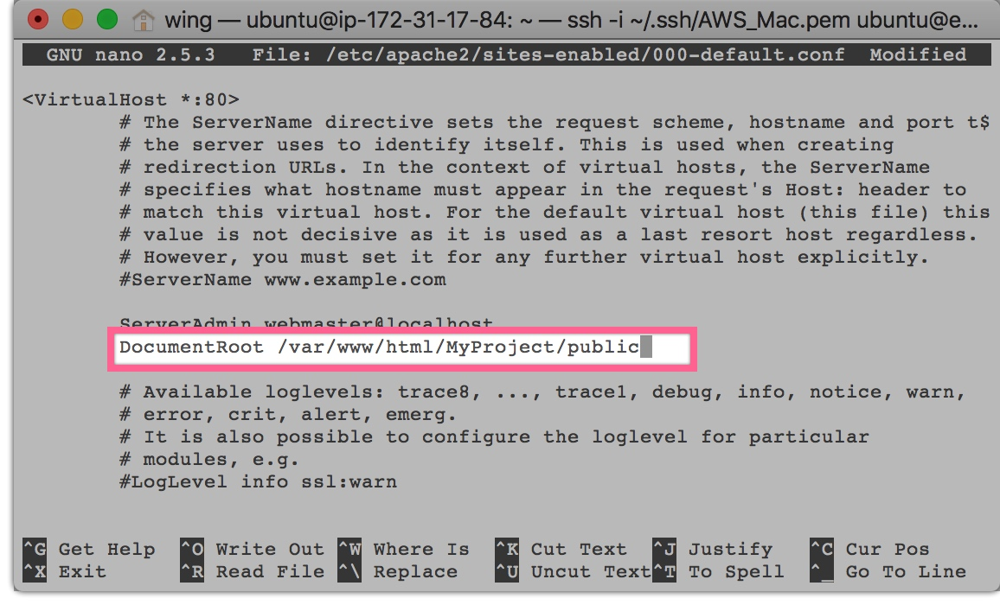
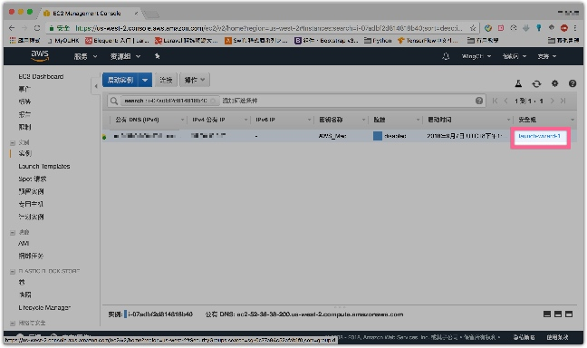
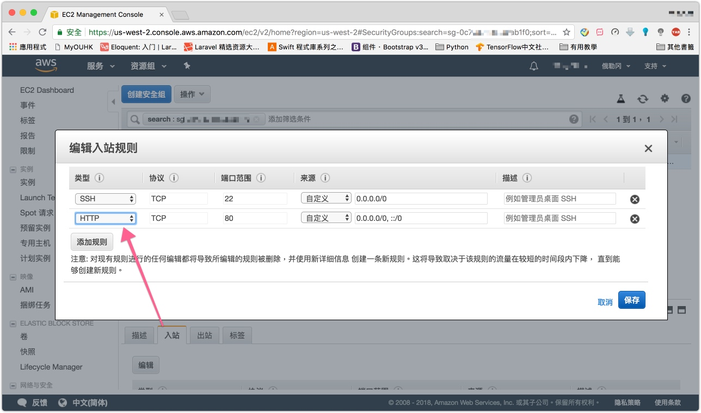
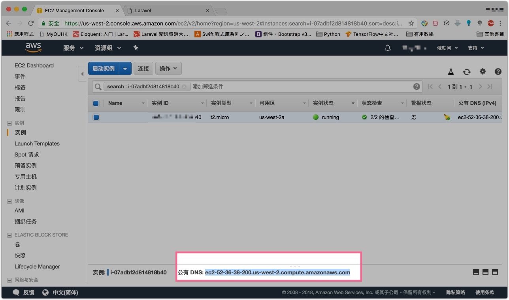
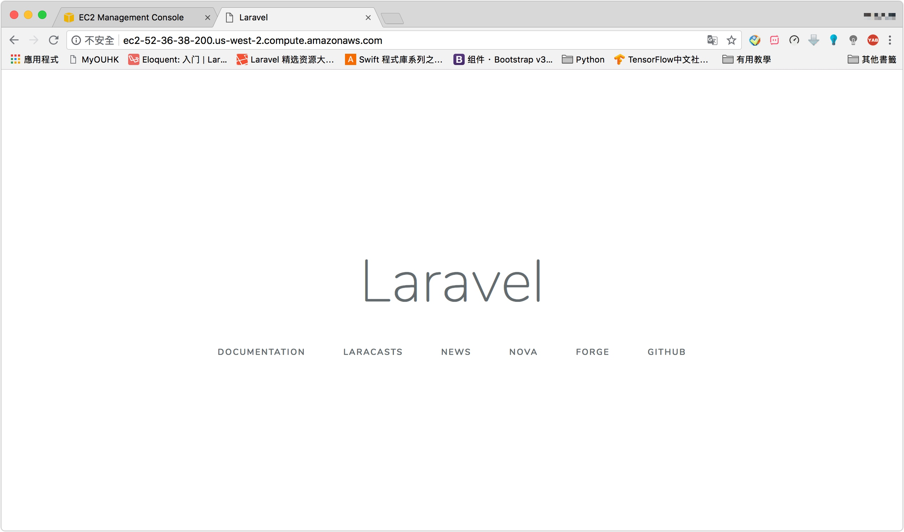

# AWS Ubuntu 安裝 Laravel

> Setup請看 : [AWS Ubuntu Setup](mweblib://15362461478442)
> 參考：https://websiteforstudents.com/install-laravel-php-framework-on-ubuntu-16-04-17-10-18-04-with-apache2-and-php-7-2-support/

**SSH登入Ubuntu server**


```sh
Welcome to Ubuntu 16.04.5 LTS (GNU/Linux 4.4.0-1065-aws x86_64)

 * Documentation:  https://help.ubuntu.com
 * Management:     https://landscape.canonical.com
 * Support:        https://ubuntu.com/advantage

  Get cloud support with Ubuntu Advantage Cloud Guest:
    http://www.ubuntu.com/business/services/cloud

0 packages can be updated.
0 updates are security updates.


The programs included with the Ubuntu system are free software;
the exact distribution terms for each program are described in the
individual files in /usr/share/doc/*/copyright.

Ubuntu comes with ABSOLUTELY NO WARRANTY, to the extent permitted by
applicable law.

To run a command as administrator (user "root"), use "sudo <command>".
See "man sudo_root" for details.

_____________________________________________________________________
WARNING! Your environment specifies an invalid locale.
 The unknown environment variables are:
   LC_CTYPE=zh_HK.UTF-8 LC_ALL=
 This can affect your user experience significantly, including the
 ability to manage packages. You may install the locales by running:

   sudo apt-get install language-pack-zh
     or
   sudo locale-gen zh_HK.UTF-8

To see all available language packs, run:
   apt-cache search "^language-pack-[a-z][a-z]$"
To disable this message for all users, run:
   sudo touch /var/lib/cloud/instance/locale-check.skip
_____________________________________________________________________

ubuntu@ip-172-31-17-84:~$ sudo locale-gen zh_HK.UTF-8
Generating locales (this might take a while)...
  zh_HK.UTF-8... done
Generation complete.
```

# Step 1: 安裝 Apache2

```sh
sudo apt update
sudo apt install apache2
```

```sh
sudo systemctl stop apache2.service
sudo systemctl start apache2.service
sudo systemctl enable apache2.service
```

# Step 2: 安裝 PHP 7.2 And Related Modules
> 翻譯 : https://thishosting.rocks/install-php-on-ubuntu/

-------

> 您可以使用第三方存儲庫來安裝最新版本的PHP。我們將使用OndřejSurý的存儲庫。
> 首先，確保安裝了以下軟件包，以便添加存儲庫

```
sudo apt-get update && apt-get upgrade
sudo apt-get install python-software-properties
```
> 接下來，從Ondřej添加PHP存儲庫：

```
sudo add-apt-repository ppa:ondrej/php
```
> 最後，更新您的包列表：

```
sudo apt-get update
```


-------
> 添加存儲庫後，可以使用以下命令安裝PHP 7.2：

```
sudo apt-get install php7.2
```
> 此命令將安裝其他軟件包：

> libapache2-MOD-php7.2
> libargon2-0
> libsodium23
> libssl1.1
> php7.2-CLI
> php7.2常見
> php7.2，JSON
> php7.2-opcache
> php7.2-的ReadLine

-------
> 檢查服務器上是否安裝了PHP 7.2

```
php -v
```
> 安裝PHP 7.2其他常用模塊

```
sudo apt-get install php-pear php7.2-curl php7.2-dev php7.2-good php7.2-mbstring php7.2-zip php7.2-mysql php7.2-xml
```

-------

# Step 3: 安裝 Composer

```
curl -sS https://getcomposer.org/installer | sudo php -- --install-dir=/usr/local/bin --filename=composer
```

# Step 4: 安裝 Laravel

```
cd /var/www/html
sudo composer create-project laravel/laravel MyProject --prefer-dist
```

```
sudo chown -R www-data:www-data /var/www/html/MyProject/
sudo chmod -R 755 /var/www/html/MyProject/
```


# Step 5: 設定Apache首頁

> laravel 默認首頁是`MyProject/public/`

```
sudo nano /etc/apache2/sites-enabled/000-default.conf
```


> 開啟apache

```
sudo systemctl restart apache2.service
```



> 在aws實例中打開http port




# Step 6 : Test

> 取得server url




> 成功!!!




