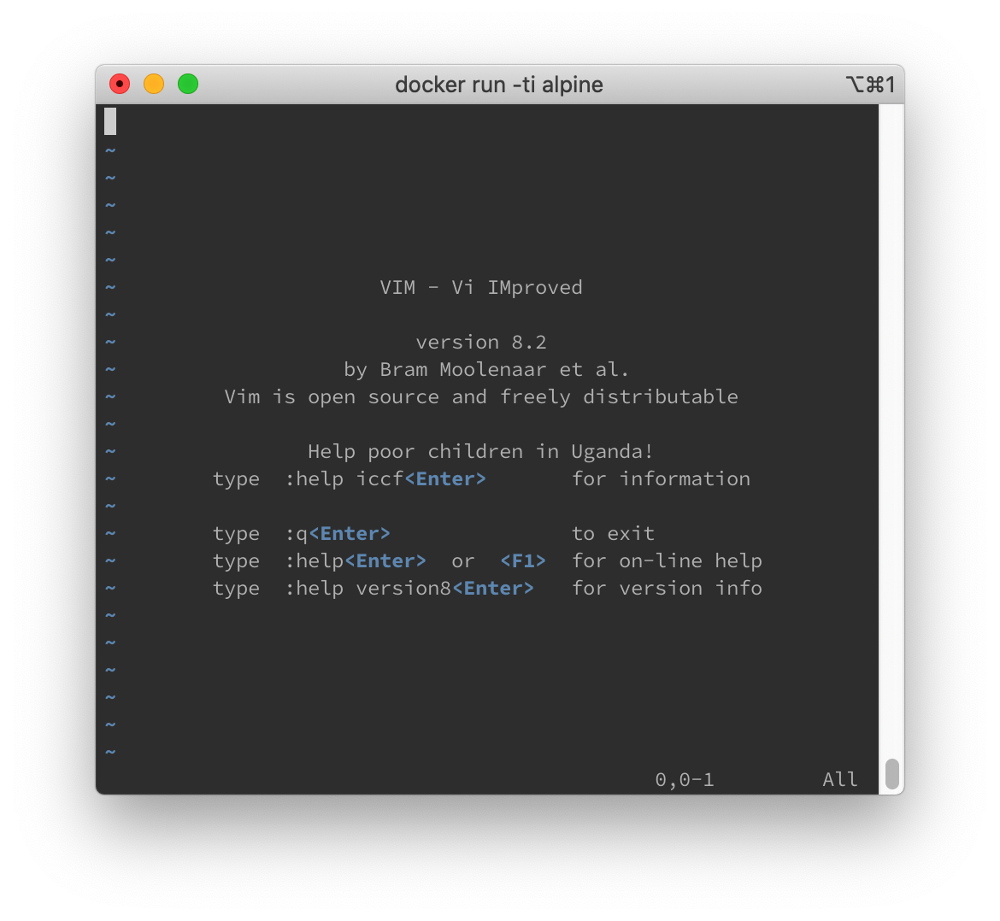
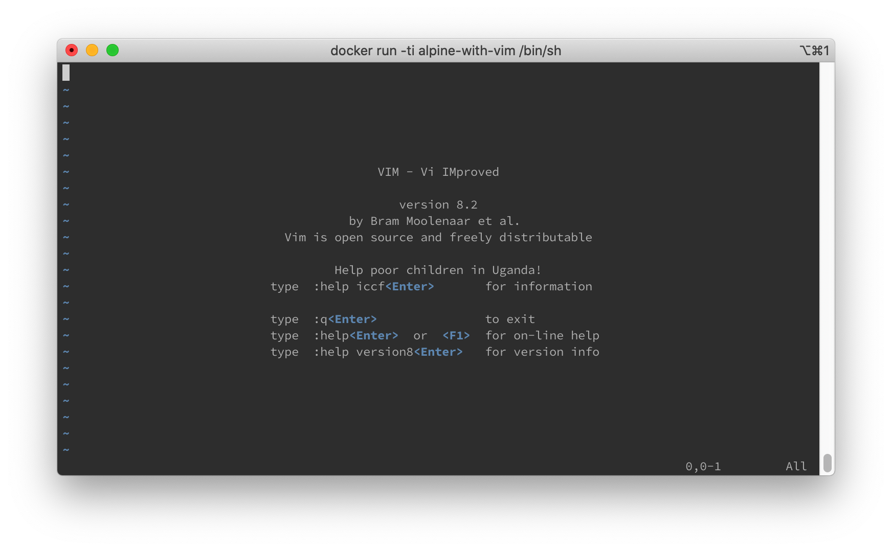

# Docker 自定 image

首先運行一個`alpine:latest`的image

```shell
docker run -ti alpine:latest

Unable to find image 'alpine:latest' locally
latest: Pulling from library/alpine
aad63a933944: Pull complete
Digest: sha256:b276d875eeed9c7d3f1cfa7edb06b22ed22b14219a7d67c52c56612330348239
Status: Downloaded newer image for alpine:latest
/ #
```

> 由於本地沒有`alpine:latest`, 所以會從[Docker hub](https://hub.docker.com/_/alpine)下載一次到本地

嘗試使用`vim` ， 可以看到本身是沒有安裝`vim`

```shell
vim

/bin/sh: vim: not found
```

安裝`vim`

```shell
apk update && apk upgrade
apk add vim

fetch http://dl-cdn.alpinelinux.org/alpine/v3.11/main/x86_64/APKINDEX.tar.gz
fetch http://dl-cdn.alpinelinux.org/alpine/v3.11/community/x86_64/APKINDEX.tar.gz
(1/5) Installing xxd (8.2.0-r0)
(2/5) Installing lua5.3-libs (5.3.5-r2)
(3/5) Installing ncurses-terminfo-base (6.1_p20200118-r2)
(4/5) Installing ncurses-libs (6.1_p20200118-r2)
(5/5) Installing vim (8.2.0-r0)
Executing busybox-1.31.1-r9.trigger
OK: 35 MiB in 19 packages
```

現在可以使用`vim`



> 如果每次都要自己安裝十分麻煩，所以嘗試自己包裝一個`image`

建立一個`Dockerfile`檔案

```dockerfile
FROM alpine

RUN apk update && apk upgrade #可忽略
RUN apk add vim
```

利用`Dockerfile`生成一個`image`

```shell
docker build -t alpine-with-vim .

Sending build context to Docker daemon   2.56kB
Step 1/3 : FROM alpine:latest
 ---> a187dde48cd2
Step 2/3 : RUN apk update && apk upgrade
 ---> Running in ce4b795adc2a
fetch http://dl-cdn.alpinelinux.org/alpine/v3.11/main/x86_64/APKINDEX.tar.gz
fetch http://dl-cdn.alpinelinux.org/alpine/v3.11/community/x86_64/APKINDEX.tar.gz
v3.11.5-41-g3deb517cec [http://dl-cdn.alpinelinux.org/alpine/v3.11/main]
v3.11.5-39-g0b5b5381b3 [http://dl-cdn.alpinelinux.org/alpine/v3.11/community]
OK: 11268 distinct packages available
Upgrading critical system libraries and apk-tools:
(1/1) Upgrading apk-tools (2.10.4-r3 -> 2.10.5-r0)
Executing busybox-1.31.1-r9.trigger
Continuing the upgrade transaction with new apk-tools:
OK: 6 MiB in 14 packages
Removing intermediate container ce4b795adc2a
 ---> 01320e1cb037
Step 3/3 : RUN apk add vim
 ---> Running in 3045082b61d6
(1/5) Installing xxd (8.2.0-r0)
(2/5) Installing lua5.3-libs (5.3.5-r2)
(3/5) Installing ncurses-terminfo-base (6.1_p20200118-r2)
(4/5) Installing ncurses-libs (6.1_p20200118-r2)
(5/5) Installing vim (8.2.0-r0)
Executing busybox-1.31.1-r9.trigger
OK: 35 MiB in 19 packages
Removing intermediate container 3045082b61d6
 ---> 9c385d05c3a2
Successfully built 9c385d05c3a2
Successfully tagged alpine-with-vim:latest
```

> 可以看到在生成`image`時已經按照`Dockerfile`安裝`vim`

現在有兩個`image`, 分別是原來的`alpine`和修改過的`alpine-with-vim`

```shell
docker image ls

REPOSITORY          TAG                 IMAGE ID            CREATED             SIZE
alpine-with-vim     latest              9c385d05c3a2        4 minutes ago       34.1MB
alpine              latest              a187dde48cd2        2 weeks ago         5.6MB
```

運行修改過的`alpine-with-vim` image

```shell
docker run -ti alpine-with-vim /bin/sh

/ #
```

嘗試運行`vim`

```shell
vim
```



