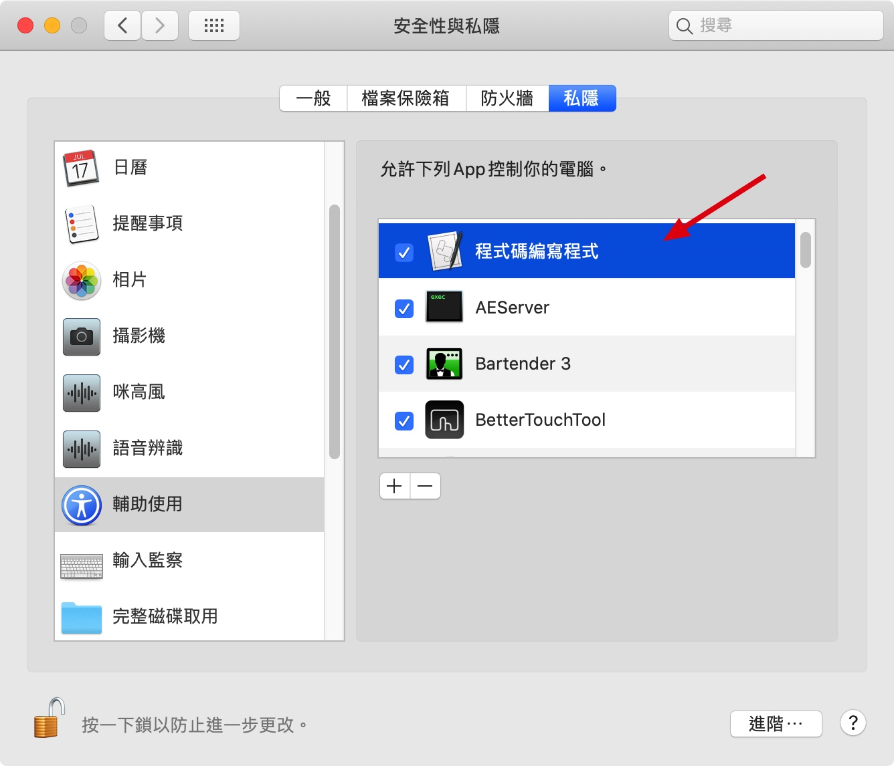
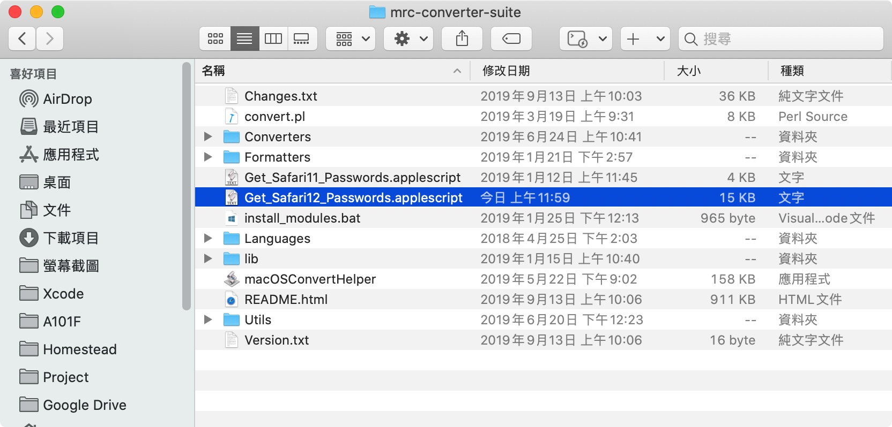
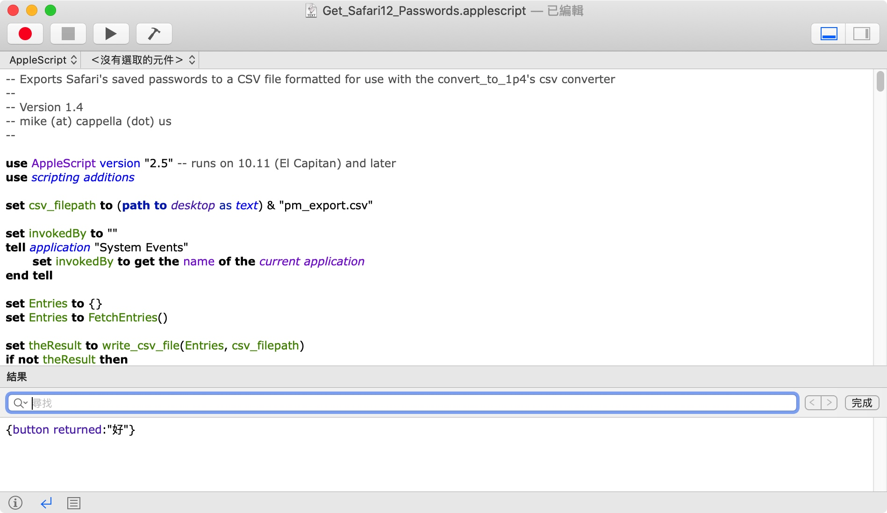
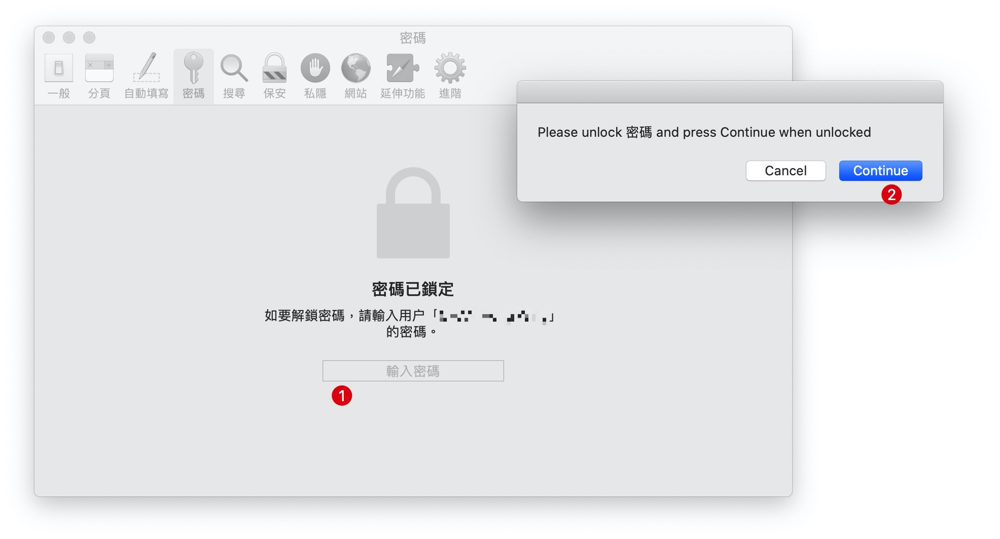
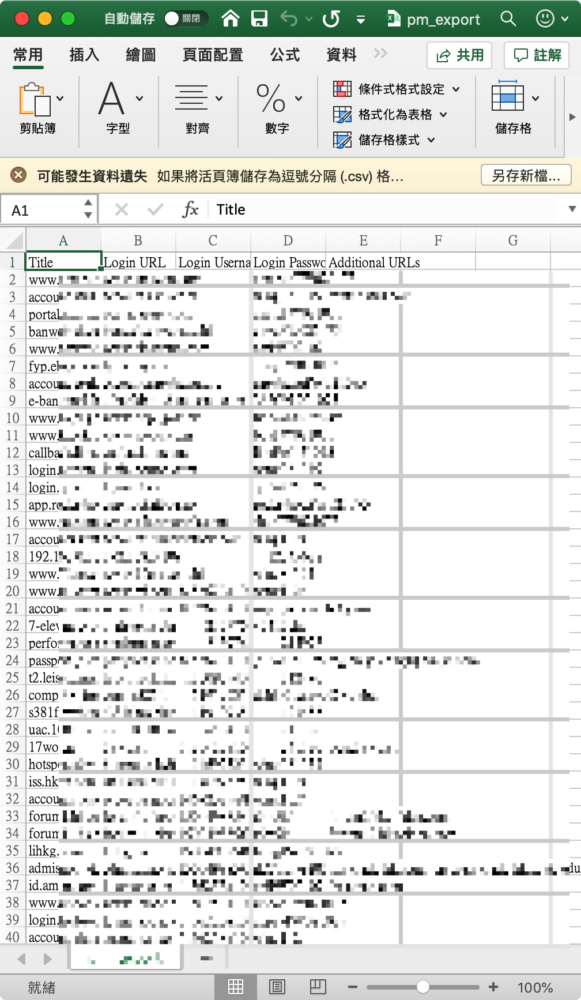

# Export Safari Keychain

[MrC's Convert to 1Password Utility (mrc-converter-suite)](https://discussions.agilebits.com/discussion/30286/mrcs-convert-to-1password-utility/p1)

1. Download the [mrc-converter-suite](https://www.dropbox.com/sh/a3skeey2zqimdlv/AAD87q6N_EJZ1YoPe5SA35a1a?dl=0) zip archive.
2. Unzip the downloaded archive (see Notes below).
3. Move the mrc-converter-suite folder onto your Desktop.

-------

## Safari

> System Preferences > Security & Privacy > allow `Script Editor`

> Close `Safari`
> Double Click script

Click `run`, it will open `Safari` automatically

Enter `password` and then Click `Continue`
Script will loop `password` table and copy each row, finally generated CSV in desktop

-------

 

