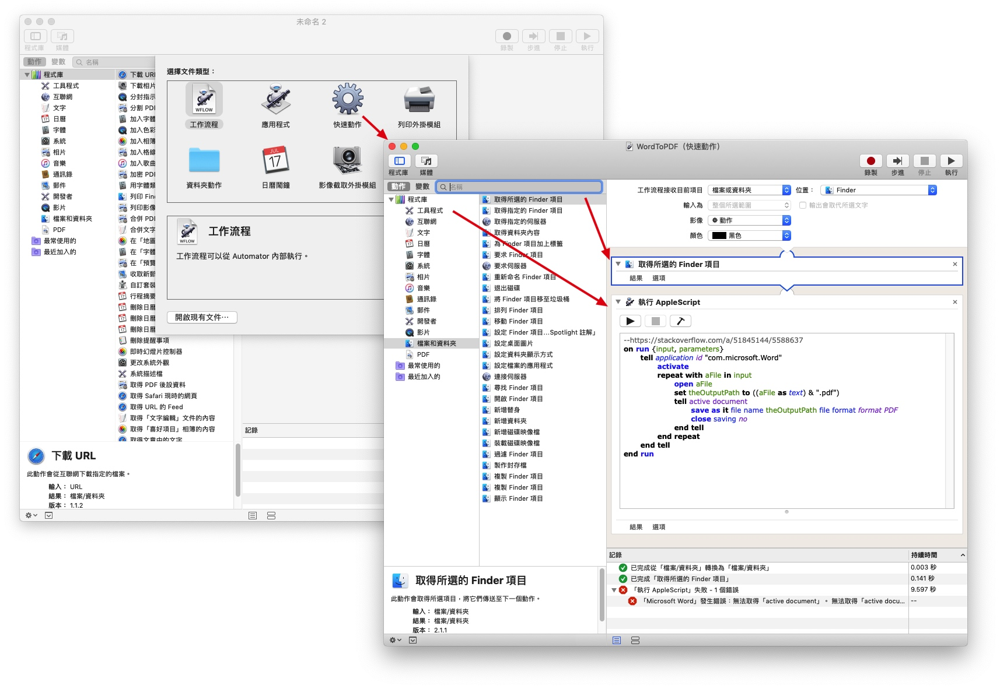
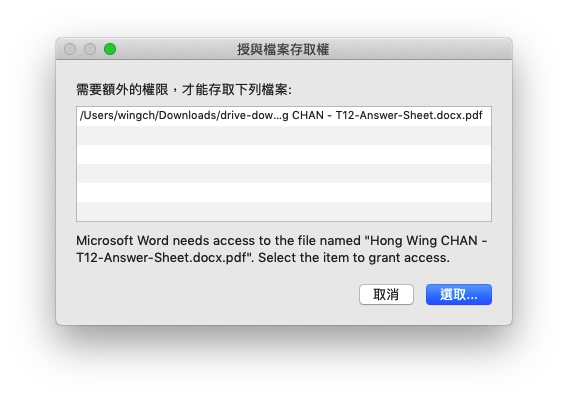
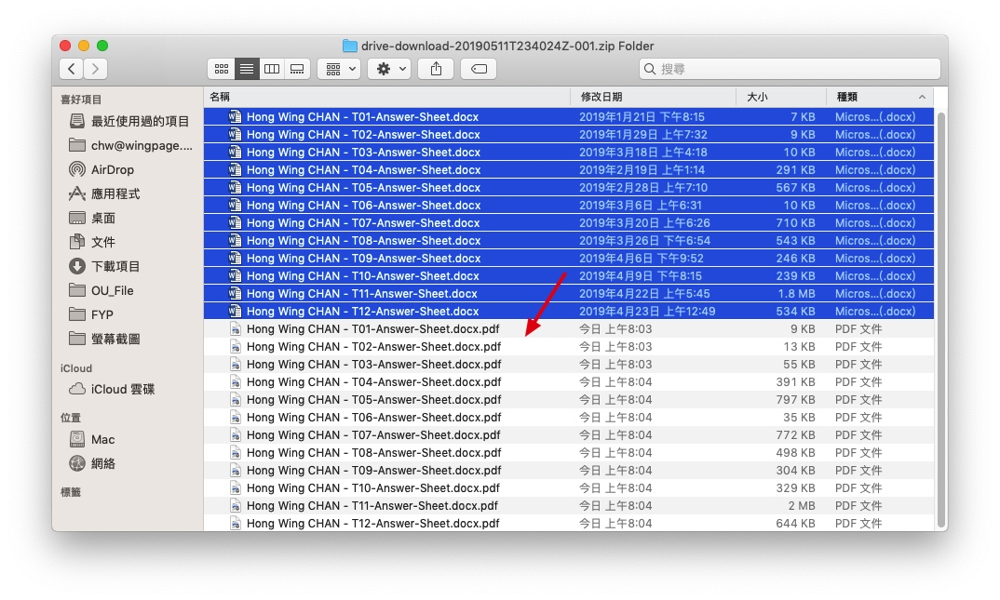

# MacOS Automator + Applescript solution for exporting docx to pdf

> https://stackoverflow.com/questions/51844514/macos-automator-applescript-solution-for-exporting-docx-to-pdf




```js
on run {input, parameters}
    tell application id "com.microsoft.Word"
        activate
        repeat with aFile in input
            open aFile
            set theOutputPath to ((aFile as text) & ".pdf")
            tell active document
                save as it file name theOutputPath file format format PDF
                close saving no
            end tell
        end repeat
    end tell
end run
```

---



唔知點解會有e個問題，但其實已經轉換完成，按取消就得。


