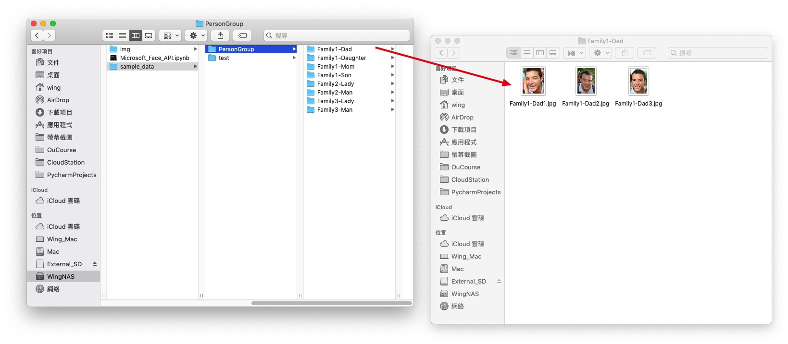
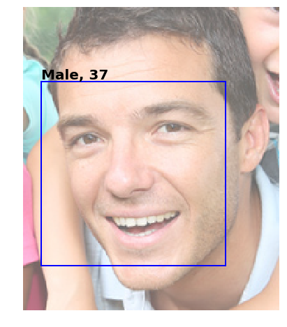
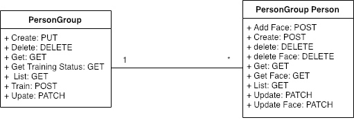
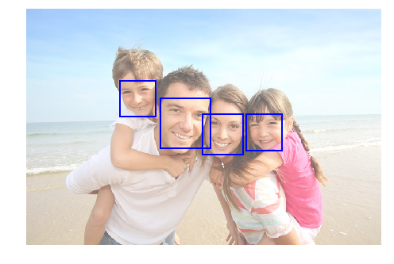
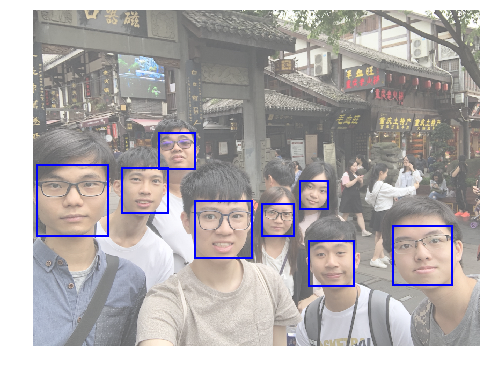

# Microsoft Face API

> 目標：建立一個人臉的資料庫，我上傳一張相片，會吿訴我有相片上有什麼人

[Microsoft azure portal](https://azure.microsoft.com/zh-tw/features/azure-portal/) -> 儀表板, 取得 face_api_url(**Endpoint**) 和 subscription_key(**keys**), 預設會有兩條keys 用其中一條即可


```python
subscription_key = '71c7995fd77a4387a2de38d12d33e86f'
assert subscription_key

face_api_url = 'https://japaneast.api.cognitive.microsoft.com/face/v1.0/'
```

下載官方的[示範圖片](https://github.com/Microsoft/Cognitive-Face-Windows/tree/master/Data),這裡我把測試用的相片放進了“test”
```bash
.
├── PersonGroup
│   ├── Person
│   │   ├── Person_face_01.jpg
│   │   ├── Person_face_02.jpg
│   │   └── Person_face_03.jpg
│   ├── Person
│   │   ├── Person_face_01.jpg
│   │   ├── ...
└── test
    ├── test1.jpg
    ├── ...
```



首先，用[Detect](https://japaneast.dev.cognitive.microsoft.com/docs/services/563879b61984550e40cbbe8d/operations/563879b61984550f30395236)功能測試是否運作正常


```python
import requests
import json
detect_api_url = face_api_url + 'detect/'

headers = {'Ocp-Apim-Subscription-Key': subscription_key, 'Content-Type':'application/octet-stream'}
params = {
    'returnFaceId': 'true',
    'returnFaceLandmarks': 'false',
    'returnFaceAttributes': 'age,gender'
}
image_path = 'sample_data/PersonGroup/Family1-Dad/Family1-Dad1.jpeg'
image_data = open(image_path, 'rb').read()

response = requests.post(detect_api_url, params=params, headers=headers, data=image_data)
faces = response.json()

print(detect_api_url)
print(json.dumps(faces, indent=1))
```

###### Result

```shell
https://japaneast.api.cognitive.microsoft.com/face/v1.0/detect/
[
    {
       "faceId": "0ba31d7e-c5bd-491d-bbbc-9f65a5056e0f",
       "faceRectangle": {
        "top": 59,
        "left": 14,
        "width": 146,
        "height": 146
    },
    "faceAttributes": {
        "gender": "male",
        "age": 37.0
    }
    }
]
```


利用上述[Detect](https://japaneast.dev.cognitive.microsoft.com/docs/services/563879b61984550e40cbbe8d/operations/563879b61984550f30395236)的結果，畫出面部矩形


```python
%matplotlib inline
import matplotlib.pyplot as plt
from PIL import Image
from matplotlib import patches
from io import BytesIO

image = Image.open(image_path)
plt.figure(figsize=(8, 8))
ax = plt.imshow(image, alpha=0.6)
for face in faces:
    fr = face["faceRectangle"]
    fa = face["faceAttributes"]
    origin = (fr["left"], fr["top"])
    p = patches.Rectangle(
        origin, fr["width"], fr["height"], fill=False, linewidth=2, color='b')
    ax.axes.add_patch(p)
    plt.text(origin[0], origin[1], "%s, %d"%(fa["gender"].capitalize(), fa["age"]),
             fontsize=20, weight="bold", va="bottom")
_ = plt.axis("off")
```

###### Result



---

好，現在我們開始建立人臉的資料庫 [PersonGroup- Create](https://japaneast.dev.cognitive.microsoft.com/docs/services/563879b61984550e40cbbe8d/operations/563879b61984550f30395244)




```python
# PUT
# Query parameters
params = {
    'personGroupId': 'mypersongroup'
}

# Headers
headers = {
    'Content-Type': 'application/json',
    'Ocp-Apim-Subscription-Key': subscription_key,
}

# Request body
request_body = {
    'name' : 'group1',
    'userData' : 'user-provided data attached to the person group.',
}

# Request URL
personGroup_request_URL = "{0}persongroups/{1}".format(face_api_url, params['personGroupId'])

print(personGroup_request_URL)

```

###### Result
    
```
https://japaneast.api.cognitive.microsoft.com/face/v1.0/persongroups/mypersongroup
```


-------

```python
import requests
import json

# 唔知點解要加json.dumps(), 但上面唔洗
response = requests.put(personGroup_request_URL, params=params, headers=headers, data=json.dumps(request_body))

# 200的話代表正常, A successful call returns an empty response body.
print(response)
# 不正常可能代表personGroup已存在
```
###### Result
    
```
<Response [409]>
```


可以利用 [PersonGroup - List](https://japaneast.dev.cognitive.microsoft.com/docs/services/563879b61984550e40cbbe8d/operations/563879b61984550f30395248/console)查看現有的PersonGroup


```python
import requests
import json

# GET
# Query parameters
params = {
    'start': '',
    'top': ''
}

# Headers
headers = {
    'Ocp-Apim-Subscription-Key': subscription_key,
}

personGroupList_request_URL = "{0}persongroups".format(face_api_url)

response = requests.get(personGroupList_request_URL, params=params, headers=headers)
print(json.dumps(response.json(), indent=1))
```
###### Result
    
```
[
    {
      "personGroupId": "mypersongroup",
      "name": "group1",
      "userData": "user-provided data attached to the person group."
    }
]
```

建立完PersonGroup後，要[建立 PersonGroup Person](https://japaneast.dev.cognitive.microsoft.com/docs/services/563879b61984550e40cbbe8d/operations/563879b61984550f3039523c)，PersonGroup-Person代表一個人的意思

> 建立一個PersonGroup Person- Dad


```python
# POST
# Query parameters
params = {
    'personGroupId': 'mypersongroup'
}

# Headers
headers = {
    'Content-Type': 'application/json',
    'Ocp-Apim-Subscription-Key': subscription_key,
}

# Request body
request_body = {
    'name' : 'Dad',
    'userData' : 'only for demo',
}

# Request URL
personGroupPersonCreate_request_URL = "{0}persongroups/{1}/persons".format(face_api_url, params['personGroupId'])

#https://japaneast.api.cognitive.microsoft.com/face/v1.0/persongroups/{personGroupId}/persons

print(personGroupPersonCreate_request_URL)

response = requests.post(personGroupPersonCreate_request_URL, params=params, headers=headers, data=json.dumps(request_body))

#如果成功會return personId
print(json.dumps(response.json(), indent=1))
```

    https://japaneast.api.cognitive.microsoft.com/face/v1.0/persongroups/mypersongroup/persons
    {
     "personId": "25364bb2-9eb4-4140-8852-0a99dd6ec833"
    }


### 將Face添加到 PersonGroup Person
> 將Dad的個人照片添加到上述已建立的PersonGroup Person - Dad


```python
from IPython.display import Image
from IPython.display import display

image_1 = Image(filename='sample_data/PersonGroup/Family1-Dad/Family1-Dad1.jpg') 
image_2 = Image(filename='sample_data/PersonGroup/Family1-Dad/Family1-Dad2.jpg') 
image_3 = Image(filename='sample_data/PersonGroup/Family1-Dad/Family1-Dad3.jpg') 

display(image_1, image_2,image_3)
```


```python
import requests
import json

# POST
# Query parameters
params = {
    'personGroupId': 'mypersongroup',
    'personId': '25364bb2-9eb4-4140-8852-0a99dd6ec833',
    'userData': '',
    'targetFace': '',
}

# Headers
headers = {
    'Content-Type': 'application/octet-stream',
    'Ocp-Apim-Subscription-Key': subscription_key,
}

image1_data = open('sample_data/PersonGroup/Family1-Dad/Family1-Dad1.jpg', 'rb').read()
image2_data = open('sample_data/PersonGroup/Family1-Dad/Family1-Dad2.jpg', 'rb').read()
image3_data = open('sample_data/PersonGroup/Family1-Dad/Family1-Dad3.jpg', 'rb').read()


# Request URL
personGroupPersonAddFace_request_URL = "{0}persongroups/{1}/persons/{2}/persistedFaces".format(face_api_url, params['personGroupId'],params['personId'])
response1 = requests.post(personGroupPersonAddFace_request_URL, params=params, headers=headers, data=image1_data)
response2 = requests.post(personGroupPersonAddFace_request_URL, params=params, headers=headers, data=image2_data)
response3 = requests.post(personGroupPersonAddFace_request_URL, params=params, headers=headers, data=image3_data)

#成功會return翻個persistedFaceId
print(json.dumps(response1.json(), indent=1))
print(json.dumps(response2.json(), indent=1))
print(json.dumps(response3.json(), indent=1))
```

###### Result

``` 
{
    "persistedFaceId": "9818378c-c83d-4504-9b3f-1e279a69de60"
}
{
    "persistedFaceId": "b45f2795-af2c-49bd-b827-ea067b6527b1"
}
{
    "persistedFaceId": "676f087f-5692-485c-a97c-7dca43c37081"
}
```

-------


```python
# 可以check翻
# GET
# Query parameters
params = {
    'start': '',
    'top': ''
}

# Headers
headers = {
    'Ocp-Apim-Subscription-Key': subscription_key,
}

personGroupPersonList_request_URL = "{0}persongroups/mypersongroup/persons".format(face_api_url)
response = requests.get(personGroupPersonList_request_URL, params=params, headers=headers)
print(response.url)
print(json.dumps(response.json(), indent=1))

#可以見到Dad 有3個persistedFaceId, 代表有3張相(face)
```
###### Result

    https://japaneast.api.cognitive.microsoft.com/face/v1.0/persongroups/mypersongroup/persons?start=&top=
    [
     {
      "personId": "7272791b-0f6c-41f9-a764-ba4e51e71e61",
      "persistedFaceIds": [
       "1ca1f7e7-4f53-4a0c-a7ee-7227c4288190",
       "7dd6f337-77a6-462c-9b90-c99df6efebe4",
       "de454eef-aaa4-44ed-8a46-0e4b60a03e9c"
      ],
      "name": "Kwan",
      "userData": "only for demo"
     },
     {
      "personId": "977ce31e-8ec6-4866-bd42-de8309ea11dd",
      "persistedFaceIds": [
       "96f6aae9-9840-40be-91cf-4140a31517d3",
       "b195a1c2-503d-47ae-97b3-8a861b450853",
       "e475644d-02fb-45f0-8038-33de374507ab"
      ],
      "name": "Samson",
      "userData": "demo"
     },
     {
      "personId": "f5311f19-8d03-41d3-b29c-488213ca70b5",
      "persistedFaceIds": [
       "3acdd591-c11e-4797-a7fe-301c2b32b37f",
       "7cd89da5-45f3-483d-adb3-23c4d077c66f"
      ],
      "name": "Wing",
      "userData": "demo"
     }
    ]


##  PersonGroup - Train

> 每次加完face, 都要train一次先用到，train要時間，不是即時完成


```python
import requests
import json

# POST
# Query parameters
params = {
    'personGroupId': 'mypersongroup'
}

# Headers
headers = {
    'Ocp-Apim-Subscription-Key': subscription_key,
}

# https://japaneast.api.cognitive.microsoft.com/face/v1.0/persongroups/{personGroupId}/train

# Request URL
personGroupTrain_request_URL = "{0}persongroups/{1}/train".format(face_api_url, params['personGroupId'])
response = requests.post(personGroupTrain_request_URL, params=params, headers=headers)
#回應202 成功調用將返回一個空的JSON正文。
print(response)
```
###### Result
    <Response [202]>


可以用 PersonGroup - Get Training Status，查看training的進度


```python
personGroupTrainStatus_request_URL = "{0}persongroups/{1}/training".format(face_api_url, params['personGroupId'])
response = requests.get(personGroupTrainStatus_request_URL, params=params, headers=headers)
print(json.dumps(response.json(), indent=1))

```
###### Result
    {
     "status": "succeeded",
     "createdDateTime": "2018-12-19T10:36:37.0117456Z",
     "lastActionDateTime": "2018-12-19T10:36:37.1967762Z",
     "message": null
    }


### 識別

> 照片-> Face - Detect 得出相片中每個face的id -> 拎face id用Face -Identify分析出似PersonGroup入面既邊個


```python
headers = {'Ocp-Apim-Subscription-Key': subscription_key, 'Content-Type':'application/octet-stream'}
params = {
    'returnFaceId': 'true',
    'returnFaceLandmarks': 'false'
}
image_path = 'sample_data/test/identification1.jpg'
image_data = open(image_path, 'rb').read()

response = requests.post(detect_api_url, params=params, headers=headers, data=image_data)
faces = response.json()


print(json.dumps(faces, indent=1))
```
###### Result
    [
     {
      "faceId": "1a71a403-8618-4e8d-a29d-783c606498c1",
      "faceRectangle": {
       "top": 202,
       "left": 302,
       "width": 113,
       "height": 113
      }
     },
     {
      "faceId": "2c95e02a-032d-4ab8-b0c4-379d32a06e40",
      "faceRectangle": {
       "top": 238,
       "left": 398,
       "width": 91,
       "height": 91
      }
     },
     {
      "faceId": "1e63f32a-df7d-463c-ab69-dbf55174faad",
      "faceRectangle": {
       "top": 238,
       "left": 495,
       "width": 82,
       "height": 82
      }
     },
     {
      "faceId": "7f12211f-c3ff-4ea8-bfae-109782389849",
      "faceRectangle": {
       "top": 162,
       "left": 211,
       "width": 81,
       "height": 81
      }
     }
    ]


顯示翻出來


```python
%matplotlib inline
import matplotlib.pyplot as plt
from PIL import Image
from matplotlib import patches
from io import BytesIO

image = Image.open('sample_data/test/identification1.jpg')
plt.figure(figsize=(8, 8))
ax = plt.imshow(image, alpha=0.6)
for face in faces:
    fr = face["faceRectangle"]
    origin = (fr["left"], fr["top"])
    p = patches.Rectangle(
        origin, fr["width"], fr["height"], fill=False, linewidth=2, color='b')
    ax.axes.add_patch(p)
#     plt.text(origin[0], origin[1], "%s, %d"%(fa["gender"].capitalize(), fa["age"]),
#              fontsize=20, weight="bold", va="bottom")
_ = plt.axis("off")
```





```python
# 取得所有faceId
faceIds = []
for face in faces:
  faceIds.append(face['faceId'])
faceIds
```

###### Result

    ['b83e9725-2102-4349-bc60-fd53d8886f2e',
     'b3ff388e-bbb3-49e7-b391-ee76f42e3721',
     '26a9f911-fcd0-4b90-a711-2b057dd9fd7a',
     '01c73367-836b-4081-8fc2-dfc10a88d3e3']


```python
# POST
# Query parameters
params = {
    
}

# Headers
headers = {
    'Content-Type': 'application/json',
    'Ocp-Apim-Subscription-Key': subscription_key,
}

# Request body
request_body = {
    "personGroupId": "mypersongroup",
    "faceIds":faceIds,
    "maxNumOfCandidatesReturned": 1,
    "confidenceThreshold": 0.5
}

# Request URL
faceIdentify_request_URL = "{0}identify".format(face_api_url)

response = requests.post(faceIdentify_request_URL, params=params, headers=headers, data=json.dumps(request_body))
print(response.url)
print(json.dumps(response.json(), indent=1))

# 結果顯示"faceId": "b83e9725-2102-4349-bc60-fd53d8886f2e" 與 "personId": "25364bb2-9eb4-4140-8852-0a99dd6ec833"(Dad個id) 有0.80474 相似
```

###### Result

    https://japaneast.api.cognitive.microsoft.com/face/v1.0/identify
    [
     {
      "faceId": "b83e9725-2102-4349-bc60-fd53d8886f2e",
      "candidates": [
       {
        "personId": "25364bb2-9eb4-4140-8852-0a99dd6ec833",
        "confidence": 0.80474
       }
      ]
     },
     {
      "faceId": "b3ff388e-bbb3-49e7-b391-ee76f42e3721",
      "candidates": []
     },
     {
      "faceId": "26a9f911-fcd0-4b90-a711-2b057dd9fd7a",
      "candidates": []
     },
     {
      "faceId": "01c73367-836b-4081-8fc2-dfc10a88d3e3",
      "candidates": []
     }
    ]


# 實作

> 建立2個PersonGroup Person


```python
# POST
# Query parameters
params = {
    'personGroupId': 'mypersongroup'
}

# Headers
headers = {
    'Content-Type': 'application/json',
    'Ocp-Apim-Subscription-Key': subscription_key,
}

# Request body
request_body1 = {
    'name' : 'Wing',
    'userData' : 'demo',
}

request_body2 = {
    'name' : 'Samson',
    'userData' : 'demo',
}

# Request URL
personGroupPersonCreate_request_URL = "{0}persongroups/{1}/persons".format(face_api_url, params['personGroupId'])

#https://japaneast.api.cognitive.microsoft.com/face/v1.0/persongroups/{personGroupId}/persons

print(personGroupPersonCreate_request_URL)

response1 = requests.post(personGroupPersonCreate_request_URL, params=params, headers=headers, data=json.dumps(request_body1))

#如果成功會return personId
print(json.dumps(response1.json(), indent=1))
response2 = requests.post(personGroupPersonCreate_request_URL, params=params, headers=headers, data=json.dumps(request_body2))
print(json.dumps(response2.json(), indent=1))

```

###### Result
    https://japaneast.api.cognitive.microsoft.com/face/v1.0/persongroups/mypersongroup/persons
    {
     "personId": "f5311f19-8d03-41d3-b29c-488213ca70b5"
    }
    {
     "personId": "977ce31e-8ec6-4866-bd42-de8309ea11dd"
    }


### 將Face添加到 PersonGroup Person


```python
import requests
import json

# POST
# Query parameters
params_wing = {
    'personGroupId': 'mypersongroup',
    'personId': 'f5311f19-8d03-41d3-b29c-488213ca70b5',
    'userData': '',
    'targetFace': '',
}

params_samson = {
    'personGroupId': 'mypersongroup',
    'personId': '977ce31e-8ec6-4866-bd42-de8309ea11dd',
    'userData': '',
    'targetFace': '',
}
# Headers
headers = {
    'Content-Type': 'application/octet-stream',
    'Ocp-Apim-Subscription-Key': subscription_key,
}

wing_image0_data = open('PersonGroup/wing/wing_0.jpg', 'rb').read()
wing_image1_data = open('PersonGroup/wing/wing_1.jpg', 'rb').read()
wing_image2_data = open('PersonGroup/wing/wing_2.jpg', 'rb').read()

samson_image0_data = open('PersonGroup/samson/samson_0.jpg', 'rb').read()
samson_image1_data = open('PersonGroup/samson/samson_1.jpg', 'rb').read()
samson_image2_data = open('PersonGroup/samson/samson_2.jpg', 'rb').read()


# Request URL
personGroupPersonAddFace_request_URL_wing = "{0}persongroups/{1}/persons/{2}/persistedFaces".format(face_api_url, params_wing['personGroupId'],params_wing['personId'])
wing_response0 = requests.post(personGroupPersonAddFace_request_URL_wing, params=params_wing, headers=headers, data=wing_image0_data)
wing_response1 = requests.post(personGroupPersonAddFace_request_URL_wing, params=params_wing, headers=headers, data=wing_image1_data)
wing_response2 = requests.post(personGroupPersonAddFace_request_URL_wing, params=params_wing, headers=headers, data=wing_image2_data)

personGroupPersonAddFace_request_URL_samson = "{0}persongroups/{1}/persons/{2}/persistedFaces".format(face_api_url, params_samson['personGroupId'],params_samson['personId'])
samson_response0 = requests.post(personGroupPersonAddFace_request_URL_samson, params=params_samson, headers=headers, data=samson_image0_data)
samson_response1 = requests.post(personGroupPersonAddFace_request_URL_samson, params=params_samson, headers=headers, data=samson_image1_data)
samson_response2 = requests.post(personGroupPersonAddFace_request_URL_samson, params=params_samson, headers=headers, data=samson_image2_data)

#成功會return翻個persistedFaceId
print(json.dumps(wing_response0.json(), indent=1))
print(json.dumps(wing_response1.json(), indent=1))
print(json.dumps(wing_response2.json(), indent=1))

print(json.dumps(samson_response0.json(), indent=1))
print(json.dumps(samson_response1.json(), indent=1))
print(json.dumps(samson_response2.json(), indent=1))
```

###### Result
    {
     "error": {
      "code": "InvalidImage",
      "message": "No face detected in the image."
     }
    }
    {
     "persistedFaceId": "7cd89da5-45f3-483d-adb3-23c4d077c66f"
    }
    {
     "persistedFaceId": "3acdd591-c11e-4797-a7fe-301c2b32b37f"
    }
    {
     "persistedFaceId": "96f6aae9-9840-40be-91cf-4140a31517d3"
    }
    {
     "persistedFaceId": "b195a1c2-503d-47ae-97b3-8a861b450853"
    }
    {
     "persistedFaceId": "e475644d-02fb-45f0-8038-33de374507ab"
    }


要train一次 詳細睇上面


```python
import requests
import json
detect_api_url = face_api_url + 'detect/'

headers = {'Ocp-Apim-Subscription-Key': subscription_key, 'Content-Type':'application/octet-stream'}
params = {
    'returnFaceId': 'true',
    'returnFaceLandmarks': 'false',
    'returnFaceAttributes': 'age,gender'
}
image_path = 'IMG_1834.jpg'
image_data = open(image_path, 'rb').read()

response = requests.post(detect_api_url, params=params, headers=headers, data=image_data)
faces = response.json()

print(json.dumps(faces, indent=1))
```

###### Result
    [
     {
      "faceId": "50ce7fad-931a-4b54-af1d-034c5e0b9175",
      "faceRectangle": {
       "top": 444,
       "left": 12,
       "width": 202,
       "height": 202
      },
      "faceAttributes": {
       "gender": "male",
       "age": 22.0
      }
     },
     {
      "faceId": "af5c5aca-0765-4e33-83b6-e20b158591d8",
      "faceRectangle": {
       "top": 619,
       "left": 1031,
       "width": 169,
       "height": 169
      },
      "faceAttributes": {
       "gender": "male",
       "age": 19.0
      }
     },
     {
      "faceId": "b756184c-cbac-4449-a825-c439f9c47d3b",
      "faceRectangle": {
       "top": 545,
       "left": 463,
       "width": 165,
       "height": 165
      },
      "faceAttributes": {
       "gender": "male",
       "age": 22.0
      }
     },
     {
      "faceId": "5b26feff-d2cf-4dcf-ba4d-abac34abd001",
      "faceRectangle": {
       "top": 451,
       "left": 255,
       "width": 131,
       "height": 131
      },
      "faceAttributes": {
       "gender": "male",
       "age": 23.0
      }
     },
     {
      "faceId": "8105c2e4-d875-4d9f-96f7-7c880c3f7dd8",
      "faceRectangle": {
       "top": 660,
       "left": 790,
       "width": 130,
       "height": 130
      },
      "faceAttributes": {
       "gender": "male",
       "age": 24.0
      }
     },
     {
      "faceId": "116b84e2-b4e4-4006-bc6d-3a427b07926a",
      "faceRectangle": {
       "top": 351,
       "left": 360,
       "width": 103,
       "height": 103
      },
      "faceAttributes": {
       "gender": "male",
       "age": 22.0
      }
     },
     {
      "faceId": "088044e1-313c-4b3c-af5b-8c1b832c071b",
      "faceRectangle": {
       "top": 556,
       "left": 657,
       "width": 90,
       "height": 90
      },
      "faceAttributes": {
       "gender": "female",
       "age": 19.0
      }
     },
     {
      "faceId": "eaa09b68-b769-43a0-9a2c-668bd777cefa",
      "faceRectangle": {
       "top": 488,
       "left": 765,
       "width": 80,
       "height": 80
      },
      "faceAttributes": {
       "gender": "female",
       "age": 11.0
      }
     }
    ]


利用上述結果，畫出面部矩形

```python
%matplotlib inline
import matplotlib.pyplot as plt
from PIL import Image
from matplotlib import patches
from io import BytesIO

image = Image.open(image_path)
plt.figure(figsize=(8, 8))
ax = plt.imshow(image, alpha=0.6)
for face in faces:
    fr = face["faceRectangle"]
    fa = face["faceAttributes"]
    origin = (fr["left"], fr["top"])
    p = patches.Rectangle(
        origin, fr["width"], fr["height"], fill=False, linewidth=2, color='b')
    ax.axes.add_patch(p)
_ = plt.axis("off")
```

###### Result




取得所有faceId
```python
faceIds = []
for face in faces:
  faceIds.append(face['faceId'])
faceIds
```


###### Result
    ['50ce7fad-931a-4b54-af1d-034c5e0b9175',
     'af5c5aca-0765-4e33-83b6-e20b158591d8',
     'b756184c-cbac-4449-a825-c439f9c47d3b',
     '5b26feff-d2cf-4dcf-ba4d-abac34abd001',
     '8105c2e4-d875-4d9f-96f7-7c880c3f7dd8',
     '116b84e2-b4e4-4006-bc6d-3a427b07926a',
     '088044e1-313c-4b3c-af5b-8c1b832c071b',
     'eaa09b68-b769-43a0-9a2c-668bd777cefa']


-------

用`faceId` 搵翻 對應 `personId` 的相似度
```python
# POST
# Query parameters
params = {
    
}

# Headers
headers = {
    'Content-Type': 'application/json',
    'Ocp-Apim-Subscription-Key': subscription_key,
}

# Request body
request_body = {
    "personGroupId": "mypersongroup",
    "faceIds":faceIds,
    "maxNumOfCandidatesReturned": 1,
    "confidenceThreshold": 0.6
}

# Request URL
faceIdentify_request_URL = "{0}identify".format(face_api_url)

response = requests.post(faceIdentify_request_URL, params=params, headers=headers, data=json.dumps(request_body))
print(response.url)
print(json.dumps(response.json(), indent=1))
```

###### Result
    https://japaneast.api.cognitive.microsoft.com/face/v1.0/identify
    [
     {
      "faceId": "50ce7fad-931a-4b54-af1d-034c5e0b9175",
      "candidates": []
     },
     {
      "faceId": "af5c5aca-0765-4e33-83b6-e20b158591d8",
      "candidates": []
     },
     {
      "faceId": "b756184c-cbac-4449-a825-c439f9c47d3b",
      "candidates": [
       {
        "personId": "21db0faf-38ae-4170-8103-fb7d0a39117a",
        "confidence": 0.7223
       }
      ]
     },
     {
      "faceId": "5b26feff-d2cf-4dcf-ba4d-abac34abd001",
      "candidates": []
     },
     {
      "faceId": "8105c2e4-d875-4d9f-96f7-7c880c3f7dd8",
      "candidates": []
     },
     {
      "faceId": "116b84e2-b4e4-4006-bc6d-3a427b07926a",
      "candidates": []
     },
     {
      "faceId": "088044e1-313c-4b3c-af5b-8c1b832c071b",
      "candidates": []
     },
     {
      "faceId": "eaa09b68-b769-43a0-9a2c-668bd777cefa",
      "candidates": []
     }
    ]


顯示翻出來


```python
%matplotlib inline
import matplotlib.pyplot as plt
from PIL import Image
from matplotlib import patches
from io import BytesIO

# 為了方便，手動將personId 炒係到
wing_personId = "21db0faf-38ae-4170-8103-fb7d0a39117a";
samsonn_personId = "977ce31e-8ec6-4866-bd42-de8309ea11dd";
knaw_personId = '7272791b-0f6c-41f9-a764-ba4e51e71e61';
response_json = response.json()


image = Image.open(image_path)
plt.figure(figsize=(8, 8))
ax = plt.imshow(image, alpha=0.6)
for face in faces:
    fr = face["faceRectangle"]
    fa = face["faceAttributes"]
    origin = (fr["left"], fr["top"])
    p = patches.Rectangle(
        origin, fr["width"], fr["height"], fill=False, linewidth=2, color='b')
    ax.axes.add_patch(p)
    
    for r in response_json:
        if  face['faceId']==r['faceId'] and len(r['candidates'])!=0:
            if r['candidates'][0]['personId'] == wing_personId:
                plt.text(origin[0], origin[1], "%s, %s"%("wing",r['candidates'][0]['confidence']),fontsize=10, weight="bold", va="bottom")
                break
            elif r['candidates'][0]['personId'] == samsonn_personId:
                plt.text(origin[0], origin[1], "%s, %s"%("samson",r['candidates'][0]['confidence']),fontsize=10, weight="bold", va="bottom")
            elif r['candidates'][0]['personId'] == knaw_personId:
                plt.text(origin[0], origin[1], "%s, %s"%("knaw",r['candidates'][0]['confidence']),fontsize=10, weight="bold", va="bottom")
                break
            

_ = plt.axis("off")
```

###### Result


<!--
```python
# import os
# import json
# sample_data_path = "sample_data/PersonGroup/"

# peoples = {}
# for people_folder in os.listdir(sample_data_path):
#     # Skip if:.DS_Store @eaDir
#     if people_folder.startswith('.') or people_folder.startswith('@'):
#         continue
#     faces_path = os.path.join(sample_data_path, people_folder)
    
#     peoples[people_folder] = []
#     for face in os.listdir(faces_path):
#         if face.startswith('.') or face.startswith('@'):
#             continue
#         peoples[people_folder].append(os.path.join(faces_path, face))
        
# print(json.dumps(peoples, indent=1))
```
-->
<!--## 流程-->
