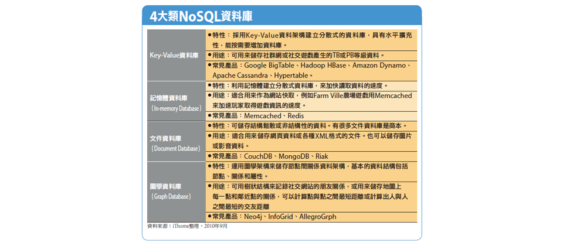

# MongoDB

MongoDB是NoSQL資料庫中的文檔數據庫 (**Document Database**)

> 參考：https://gitee.com/komavideo/LearnMongoDB




### 概念對應

| SQL | MongoDB |
| :-: | :-: |
| 數據表 (Table) | 集合 （Collection） |
| 記錄（Record） | 文檔（Document） |

-------

### 切換/新增/刪除 database 

```js
//如果無這個database， 後面操作後會自動增加
use dbName
//刪除當前database
db.dropDatabase()
```
### 增加/改名/刪除 Collection


```shell
db.createCollection("posts")
db.posts.renameCollection("newName")
db.name.drop() #成功return 1 else 0
```

### List出當前database所有Collection
```shell
show collections
```
-------
## 操件

### 加

```js
db.[collection_name].insert({jasonArray_Format});

//db.posts.insert({title:"踏地雷","rank":2,"tag":"game"});
```

### 查

```js
db.[collection_name].find({$or:[{...},{...}]});
db.[collection_name].find({"": {$in: [...]}});
db.[collection_name].find({"": {$exists: true}});

#db.posts.find({"rank": {$lt: 4}}); rank少於4

//指定字段
db.[collection_name].find({}, {field1: true, field2: 1}) //true 同 1 係同一個
意思

//sort limit skip
db.[collection_name].find({}, {).sort({"":""});
db.[collection_name].find({}, {).skip({"":""});
db.[collection_name].find({}, {).limit();
```
### 更新

```js
db.collection.update(
   <query>,
   <update>,
   {
     upsert: <boolean>,
     multi: <boolean>,
     writeConcern: <document>,
     collation: <document>,
     arrayFilters: [ <filterdocument1>, ... ]
   }
)
```


```js
// 當title是怪物猎人世界评测，rank改成10 !!! **只是頭一個**
db.posts.update({"title":"怪物猎人世界评测"}, {$set: {"rank": 10} });
// 當title是怪物猎人世界评测，rank改成10 !!! **全部改晒**
db.posts.update({"title":"怪物猎人世界评测"}, {$set: {"rank": 10}}, {multi: true});
// 呢個無個"set"字，會變覆蓋
db.posts.update({"title":"怪物猎人世界评测"}, {"rank": 99});

```
### List不同的值

```js
// 將全部tag的種類列出
 db.posts.distinct("tag");
```


### 包含
$elemMatch
