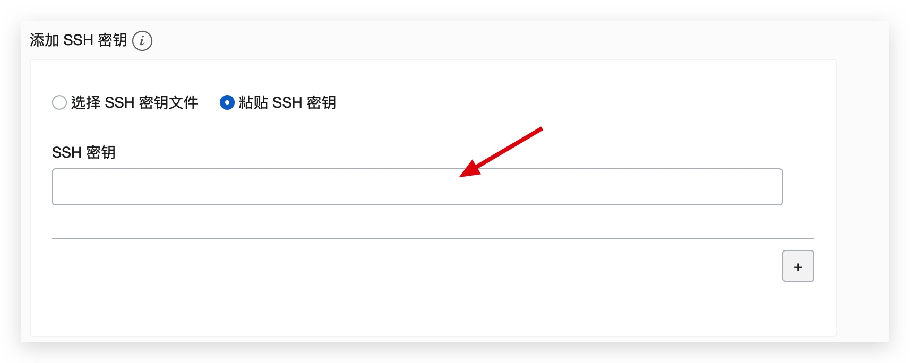
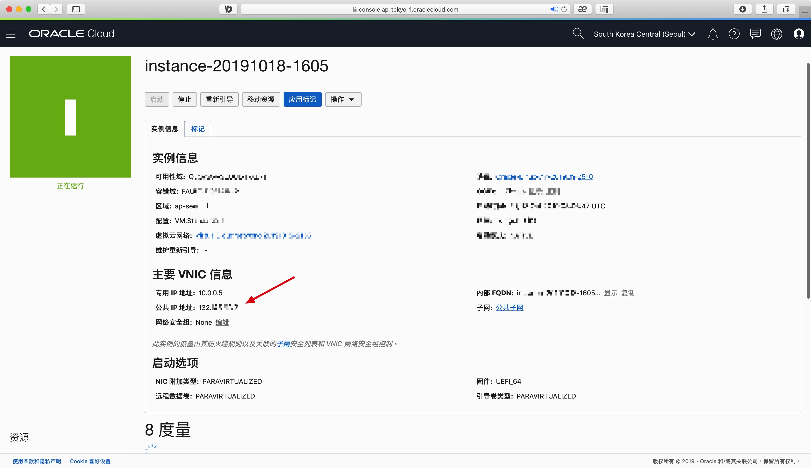
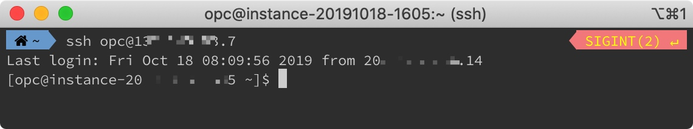
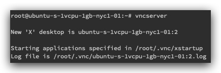
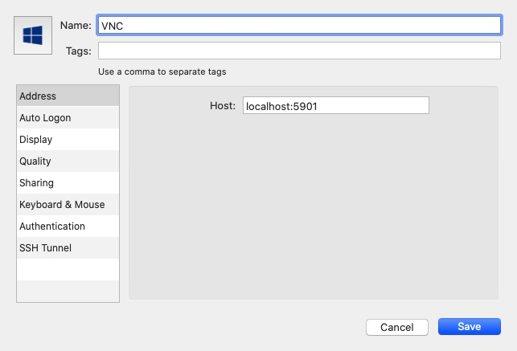
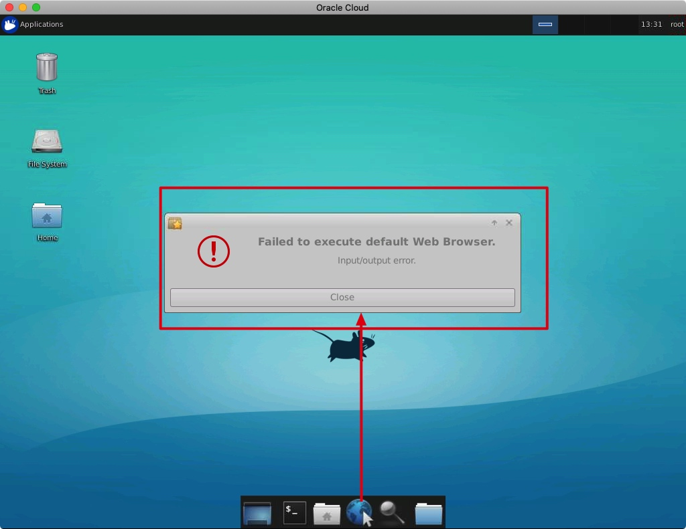
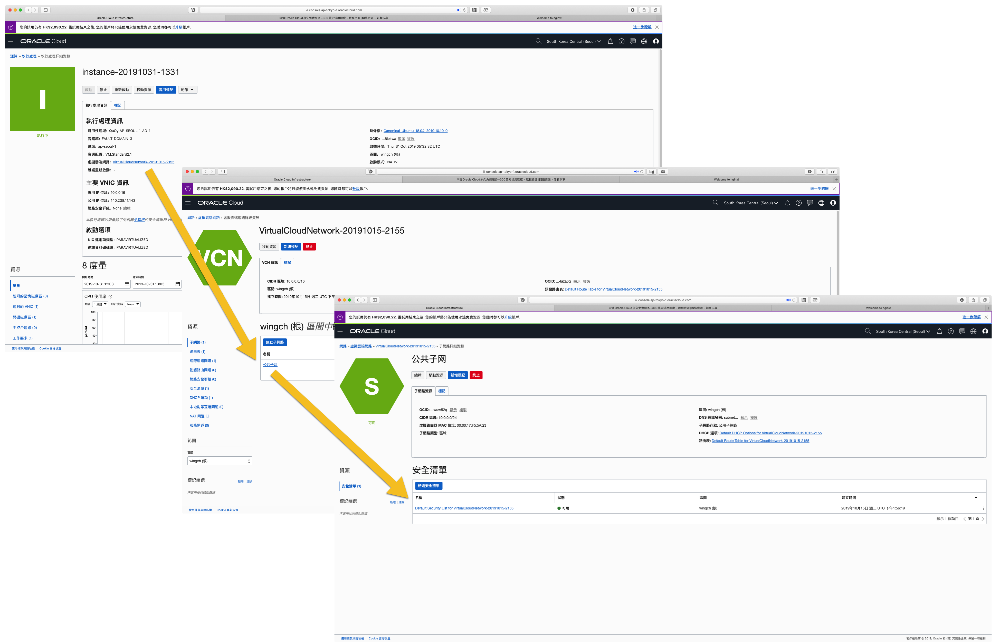
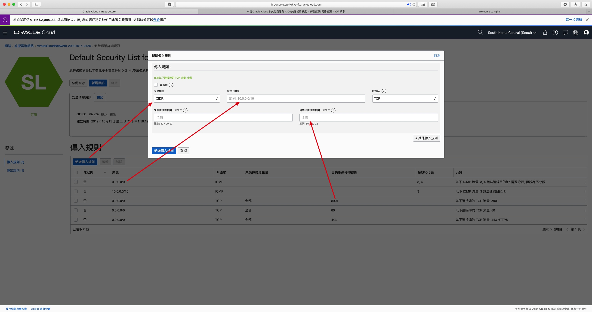

# Oracle Cloud Setup

> https://51.ruyo.net/14138.html

生成ssh key[教學](https://www.jianshu.com/p/253ca7c2e80c)

複製public key `pbcopy < ~/.ssh/id_rsa.pub`
貼上


打開 `隐藏配置、网络、存储选项 >  分配公共 IP 地址`


完成後可見ip address



```bash
#oracle linux
ssh opc@ip

#Canonical-Ubuntu-18
ssh ubuntu@ip
```



-------

## Setup Ubuntu 18 GUI and VNC

> [How to Install and Configure VNC on Ubuntu 18.04](https://www.digitalocean.com/community/tutorials/how-to-install-and-configure-vnc-on-ubuntu-18-04)

```bash
sudo apt update
sudo apt install xfce4 xfce4-goodies
sudo apt install tightvncserver

#For copy & paste https://unix.stackexchange.com/a/274692
sudo apt-get install autocutsel

# setup password between 6 to 8
vncserver
```



```bash
# Close vncserver before setup configuring VNC Server
vncserver -kill :1
```


```bash
# backup original xstartup file
mv ~/.vnc/xstartup ~/.vnc/xstartup.bak

nano ~/.vnc/xstartup
```


copy in xstartup
```
#!/bin/bash
xrdb $HOME/.Xresources
autocutsel -fork  
startxfce4 &
```


```bash
# make it executable
sudo chmod +x ~/.vnc/xstartup
# restart
vncserver

# Create an SSH connection forwards to the localhost connection for VNC.
ssh -L 5901:127.0.0.1:5901 root@142.93.61.168
```

#### Contect VNC
Use any VNC Client tool, i am using [Jump Desktop](https://jumpdesktop.com/)


**Click** `Use default config`


[How to fix "Failed to Execute Default Web Browser. Input/Output Error."](https://www.youtube.com/watch?v=PiKqqPZcn3A)




```bash
sudo apt-get install firefox
```

-------

## Firewall

> https://redthunder.blog/2019/07/04/getting-started-with-oracle-cloud-infrastructure-internet-and-nat-gateways/


Since oracle cannot use ufw [[issue](https://docs.cloud.oracle.com/iaas/Content/knownissues.htm#ufw)], need to modify iptable which is very trouble, so i open all port in iptable, only use oracle VCN to manager the port
 

```
sudo iptables -P INPUT ACCEPT
sudo iptables -P FORWARD ACCEPT
sudo iptables -P OUTPUT ACCEPT
sudo iptables -F
```

setup vcn in oracle cloud console


