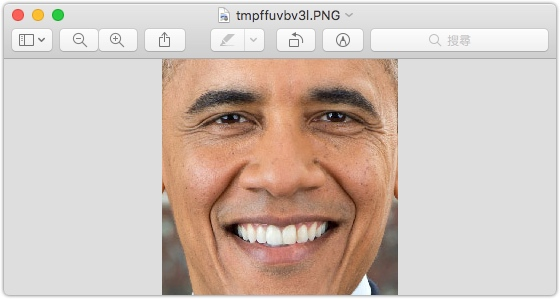
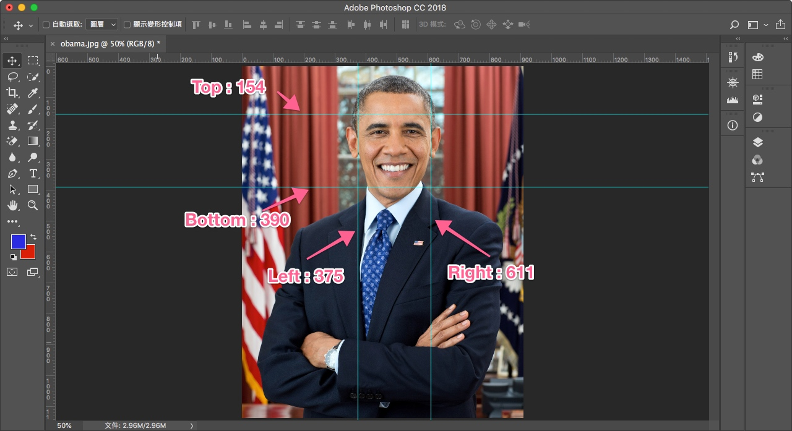
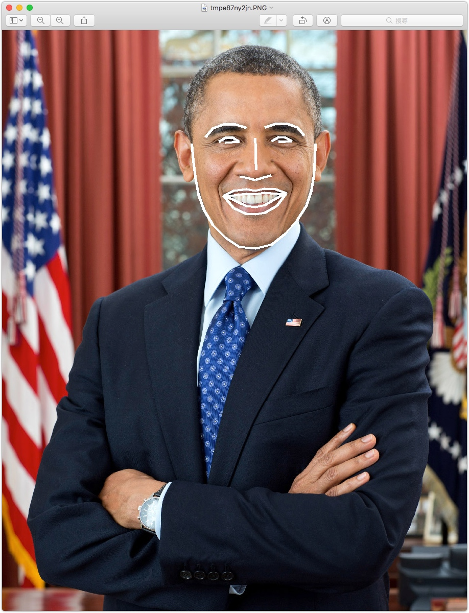

# Python face_recognition

使用的是 [face_recognition](https://github.com/ageitgey/face_recognition)，據説準確率達99.38%

説明文檔 : https://face-recognition.readthedocs.io/en/latest/face_recognition.html


教學 : ihttps://www.jianshu.com/p/4dd131567015

# 查找面孔


```python
from PIL import Image
import face_recognition

image = face_recognition.load_image_file("obama.jpg")
# number_of_times_to_upsample - 對圖像進行上採樣以查找面部的次數。數字越大，面部越小
# model - 使用哪種人臉檢測模型。“hog”不太準確，但在CPU上更快。“cnn”是一種更準確的深度學習模型，它是GPU / CUDA加速（如果可用）。默認為“hog”
face_locations = face_recognition.face_locations(image, number_of_times_to_upsample=0, model="cnn")
```

### Api : [face_locations](https://face-recognition.readthedocs.io/en/latest/_modules/face_recognition/api.html#face_locations)


> Return: A list of tuples of found face locations in css (top, right, bottom, left) 
> 
> | Top | right | Bottom | left |
> | :-: | :-: | :-: | :-: |
> | 154 | 611 |  390 | 375 |


```python
for face_location in face_locations:
     top, right, bottom, left = face_location
     face_image = image[top:bottom, left:right]
     pil_image = Image.fromarray(face_image)
     pil_image.show()
```





# 查找面部特徵

```python
from PIL import Image, ImageDraw
import face_recognition

image = face_recognition.load_image_file("your_file.jpg")
# 查找圖像中所有面部的所有面部特徵
face_landmarks_list = face_recognition.face_landmarks(image)
```
### Api : [face_landmarks](https://face-recognition.readthedocs.io/en/latest/_modules/face_recognition/api.html#face_landmarks)


| 下巴 | 左眉 | 右眉 | 鼻樑 | 鼻尖 | 左眼 | 右眼 | 上唇 | 下唇 |
| :-: | :-: | :-: | :-: | :-: | :-: | :-: | :-: | :-: |
| chin | left_eyebrow | right_eyebrow | nose_bridge | nose_tip | left_eye | right_eye | top_lip | bottom_lip |
| [0:17] | [17:22] | [22:27] | [27:31] | [31:36] | [36:42] | [42:48] | [48:55] + [[64]] + [[63]] + [[62]] + [[61]] + [[60]] | [54:60] + [[48]] + [[60]] + [[67]] + [[66]] + [[65]] + [[64]] |
 
 
```python
# Create a PIL imagedraw object so we can draw on the picture
pil_image = Image.fromarray(image)
d = ImageDraw.Draw(pil_image)

for face_landmarks in face_landmarks_list:

    # Print the location of each facial feature in this image
    for facial_feature in face_landmarks.keys():
        print("The {} in this face has the following points: {}".format(facial_feature, face_landmarks[facial_feature]))

    # Let's trace out each facial feature in the image with a line!
    for facial_feature in face_landmarks.keys():
        d.line(face_landmarks[facial_feature], width=5)

# Show the picture
pil_image.show()
```



 
#  識別圖片中的面孔

```python
import face_recognition
known_image = face_recognition.load_image_file("obama.jpg")
unknown_image = face_recognition.load_image_file("unknown.jpg")

#return : 128維面部編碼列表（圖像中每個面部一個）
obama_encoding = face_recognition.face_encodings(known_image)[0]
unknown_encoding = face_recognition.face_encodings(unknown_image)[0]

#return : true or false
results = face_recognition.compare_faces([obama_encoding], unknown_encoding)
```

### Api : [face_encodings / compare_faces](https://face-recognition.readthedocs.io/en/latest/_modules/face_recognition/api.html#compare_faces)
