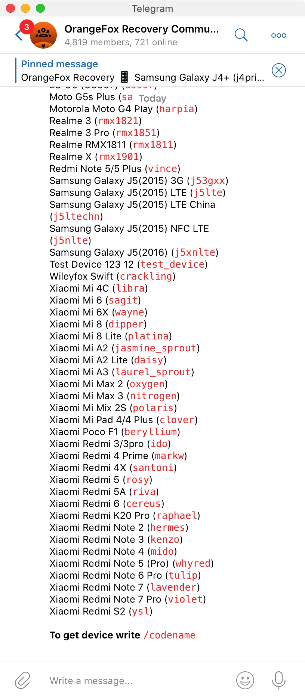
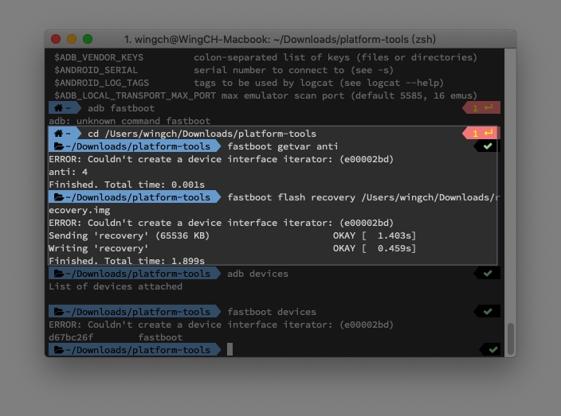
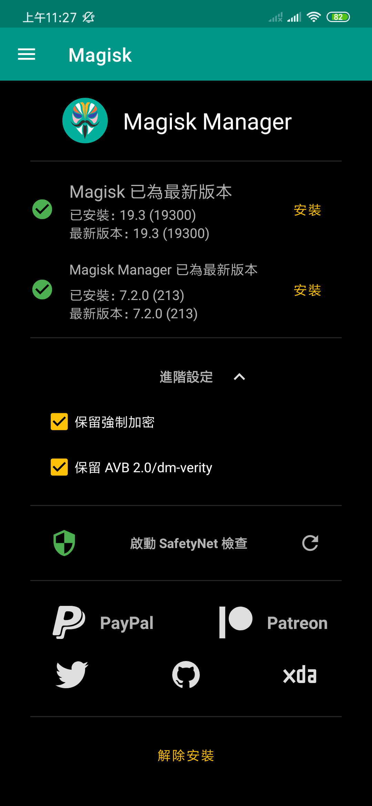

# Redmi Note 7 安裝 TWRP 和 Magisk

> 需要已解鎖!!! https://www.miui.com/unlock/index.html

## 需要文件:

twrp 不能OTA更新系統，比較麻煩
已轉用[orangefox](https://youyou-tech.com/2019/11/15/%E6%A9%99%E7%8B%90Recovery-%E4%B8%80%E6%AC%BE%E5%8F%A6%E7%B1%BB%E5%8A%9F%E8%83%BD%E4%B8%B0%E5%AF%8C%E7%9A%84/)
參入 tg群 https://t.me/OrangeFoxChat

`/list`

找到手機型號完去 [https://files.orangefox.tech/OrangeFox-Stable/]() 找到下載

-------

~~**twrp**: https://twrp.me/Devices/~~
> 搵翻自己手機既型號，如果沒有的話，要上網search，Redmi Note 7是沒有官方的，所以我找了第三方: 
> https://forum.xda-developers.com/redmi-note-7/development/recovery-unofficial-twrp-touch-recovery-t3921637
> http://www.miui.com/thread-21108605-1-1.html

**Magisk**: https://forum.xda-developers.com/apps/magisk/official-magisk-v7-universal-systemless-t3473445

> 下載後放到手機裡

adb: https://developer.android.com/studio/releases/platform-tools.html

## 步驟

> 參考: https://www.youtube.com/watch?v=Mkqt75B10nY

1. 進入fastboot模式 
    1. 關機
    2. 同時按`電源`和`音量下`按鈕
    3. 出現fastboot字眼後，利用USB連接電腦
2. 刷入`twrp`
    1. 進入剛剛下載`adb`的目錄
        1. cd /Users/wingch/Downloads/platform-tools
    2. `fastboot getvar anti`
        1. 自行上網search用途
        2. 好像是Redmi Note 5 會有問題
    3. `fastboot flash recovery /Users/wingch/Downloads/recovery.img`
        1. 刷入，`recovery.img`是剛剛twrp的檔案

1. 進入`twrp`，並安裝`Magisk`
    1. 長按`電源`按鈕，直到黑屏，**不要鬆手**
    2. 同時長按`音量上`按鈕
    3. 出現`twrp`字眼 
    4. 可以選擇語言
    5. 點擊`安裝`
    6. 找到剛剛`Magisk`的文件
        1. Magisk-v19.x.zip
    7. 成功安裝後，點擊重新啟動
2. 成功！
    1. 安裝Magisk Manager
        1. 解壓縮 `Magisk-v19.x.zip`
        2. 找到apk檔案安裝
    

## 好處
1. 全球上網
    1. MIUI預設ROOT後不能使用`全球上網`功能
    2. 進入Magisk Manager
        1. Menu -> Magisk Hide
        2. search 全球上
        3. 點擊右邊的tick

-----

#更新

> 如果安裝失裝可能是`twrp`的問題，我轉了`twrp`就成功了

1. 在[官網](http://www.miui.com/download-356.html)下載miui rom
    1. 手機設定裡下載會有加密錯誤
2. 進入`twrp`,安裝MIUI
    1. 長按`電源`按鈕，直到黑屏，**不要鬆手**
    2. 同時長按`音量上`按鈕
    3. 出現`twrp`字眼
    4. 點擊`安裝`
    5. 選擇剛剛下載的miui檔案
3. 重新刷入`twrp`和`Magisk`,因為安裝新miui後會洗掉