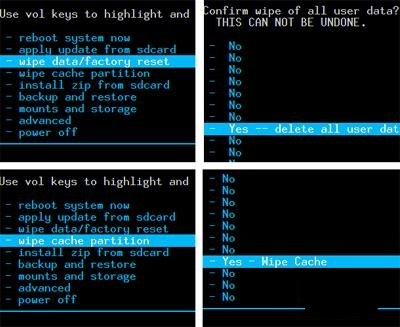
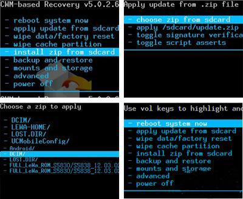

# S3 刷 Android 6

### 所需檔案
> Rom
> Google Apps 檔

### Step
1. 將所需檔案 放入SD CARD
2. 進入Recovery模式
3. 雙wipe 
 
  
1. install zip from SDCard (Rom and Google Apps)

1. Reboot System Now

###  參考網站
> http://gamebebe.blogspot.com/2014/02/androidrecovery.html
> https://www.youtube.com/watch?v=kfqwuKEBQnA

### 檔案
> Google Apps http://opengapps.org
> ROM(CWM) https://www.androidfilehost.com/?fid=24591000424941972

