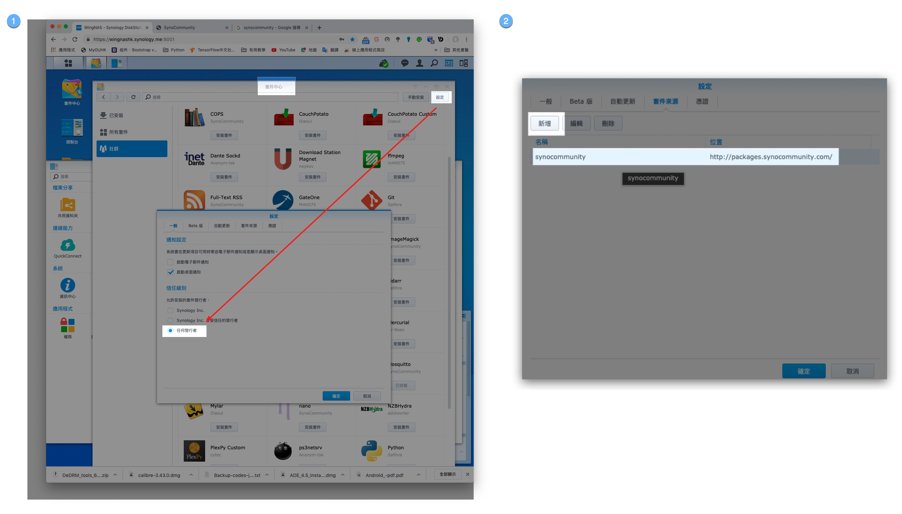
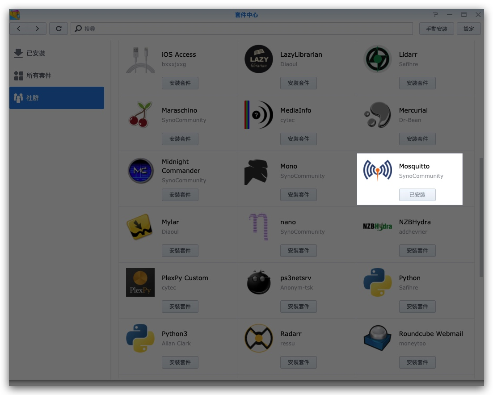
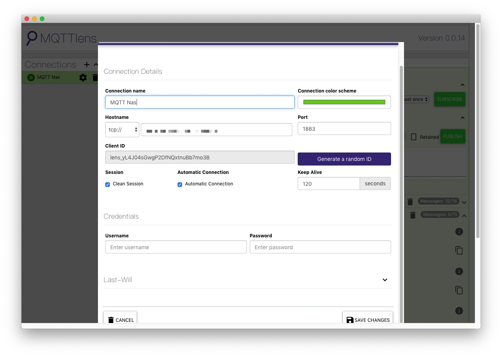

# Synology setup MQTT

> 參考: [Installing Mosquitto (MQTT) broker on Synology NAS
](https://www.youtube.com/watch?v=b3A1RJdDf-w)[MQTT教學（四）：使用MQTTLens訂閱與發布MQTT訊息](https://swf.com.tw/?p=1009)

1. 套件中心 -> 設定中開啟`任何來源`
2. 設定 -> 套件來源加入 `http://packages.synocommunity.com/`, [synocommunity官網](https://synocommunity.com/)

1. 套件中心 -> 社群，找到`mosquitto` 安裝

> 在[Installing Mosquitto (MQTT) broker on Synology NAS
](https://www.youtube.com/watch?v=b3A1RJdDf-w)的教學中，安裝後不能正常啟動，需要改一些參數，但我沒有遇到這個情況

## 測試

安裝 
Mac Client Tool:[MQTTLens](https://chrome.google.com/webstore/detail/mqttlens/hemojaaeigabkbcookmlgmdigohjobjm?hl=zh-TW)

iOS Client Tool: [Brent Petit 的「MQTTool」](https://itunes.apple.com/hk/app/mqttool/id1085976398?mt=8)

