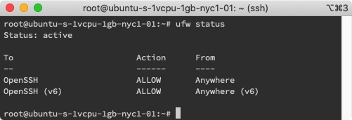
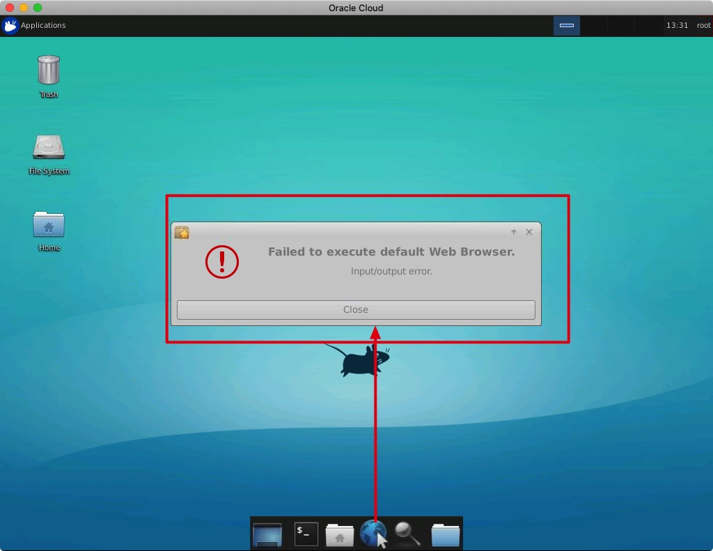

# Ubuntu install Laravel

I am using digitalocean VPS service, since [GitHub Student Developer Pack](https://education.github.com/pack) have $50 in platform credit for new users.

**OS:** Ubuntu 18.04.3 (LTS) x64


> [How to Install and Configure Laravel with LEMP on Ubuntu 18.04](https://www.digitalocean.com/community/tutorials/how-to-install-and-configure-laravel-with-lemp-on-ubuntu-18-04)

Step:

1. Initial Server Setup with Ubuntu 18.04 guide
2. Install Linux, Nginx, MySQL, PHP (LEMP stack)
3. Install Composer
4. Install Git and setup Github ssh login
5. Clone github project, deploy

-------

## 1. Initial Server Setup with Ubuntu 18.04

> https://www.digitalocean.com/community/tutorials/initial-server-setup-with-ubuntu-18-04

Get Ip


```bash
# ~/.ssh is used by default
ssh root@142.93.61.168
```


### ufw setup

[ufw](https://chusiang.gitbooks.io/working-on-gnu-linux/07.ufw.html) is an easy Firewall Management tool.

```bash
ufw app list
```


```bash
# Allow OpenSSH to make sure we can use ssh service after enabled ufw
ufw allow OpenSSH
ufw enable
```


```bash
ufw status
```



###  Install VNC

> [How to Install and Configure VNC on Ubuntu 18.04](https://www.digitalocean.com/community/tutorials/how-to-install-and-configure-vnc-on-ubuntu-18-04)


```bash
sudo apt update
sudo apt install xfce4 xfce4-goodies
sudo apt install tightvncserver

#For copy & paste https://unix.stackexchange.com/a/274692
sudo apt-get install autocutsel

# setup password between 6 to 8 
vncserver
```


```bash
# Close vncserver before setup configuring VNC Server
vncserver -kill :1
```


```bash
# backup original xstartup file
mv ~/.vnc/xstartup ~/.vnc/xstartup.bak

nano ~/.vnc/xstartup
```


copy in xstartup
```
#!/bin/bash
xrdb $HOME/.Xresources
autocutsel -fork
startxfce4 &
```


```bash
# make it executable
sudo chmod +x ~/.vnc/xstartup
# restart
vncserver

# Create an SSH connection forwards to the localhost connection for VNC.
ssh -L 5901:127.0.0.1:5901 root@142.93.61.168

# Or open 5901 port to use remote url access
sudo ufw allow 5901
```

#### Contect VNC
Use any VNC Client tool, i am using [Jump Desktop](https://jumpdesktop.com/)


**Click** `Use default config`


[How to fix "Failed to Execute Default Web Browser. Input/Output Error."](https://www.youtube.com/watch?v=PiKqqPZcn3A)




```bash
sudo apt-get install firefox
```

-------
## 2. Install Nginx, MySQL, PHP (LEMP stack)

### Nginx

> https://www.digitalocean.com/community/tutorials/how-to-install-linux-nginx-mysql-php-lemp-stack-ubuntu-18-04


```
sudo apt update
sudo apt install nginx

#Open port 80,443
sudo ufw allow 'Nginx HTTP'
sudo ufw allow 'Nginx HTTPS'
```

now, go to `localhost` in Browser will display welcome page


### MySQL

```bash
sudo apt install mysql-server

# inside mysql environment
sudo mysql
```


```bash
# Check authentication method of each MySQL user accounts
SELECT user,authentication_string,plugin,host FROM mysql.user;

+------------------+-------------------------------------------+-----------------------+-----------+
| user             | authentication_string                     | plugin                | host      |
+------------------+-------------------------------------------+-----------------------+-----------+
| root             |                                           | auth_socket           | localhost |
| mysql.session    | *THISISNOTAVALIDPASSWORDTHATCANBEUSEDHERE | mysql_native_password | localhost |
| mysql.sys        | *THISISNOTAVALIDPASSWORDTHATCANBEUSEDHERE | mysql_native_password | localhost |
| debian-sys-maint | *CC744277A401A7D25BE1CA89AFF17BF607F876FF | mysql_native_password | localhost |
+------------------+-------------------------------------------+-----------------------+-----------+
```


change `auth_socket` to `mysql_native_password`
```bash
# change authentication method and set password
ALTER USER 'root'@'localhost' IDENTIFIED WITH mysql_native_password BY 'password';

# reload the grant tables
FLUSH PRIVILEGES;

#login mysql
mysql -u root -p
```


```sql
# create database - booking
CREATE DATABASE booking;

# create user - booking_user which have all permission of database - booking
GRANT ALL ON booking.* TO 'booking_user'@'%' IDENTIFIED BY 'password' WITH GRANT OPTION;
```

#### Allow Remote Access to MySQL
> https://www.digitalocean.com/community/tutorials/how-to-allow-remote-access-to-mysql


```
# change bind-address from 127.0.0.1 to 0.0.0.0
sudo nano /etc/mysql/mysql.conf.d/mysqld.cnf

sudo systemctl restart mysql
```


```
ufw allow mysql
```

##### Try in mysql client


### PHP

```
# add universe repository to install php
sudo add-apt-repository universe

sudo apt install php-fpm php-mysql
sudo apt install php-mbstring php-xml php-bcmath
```

#### Nginx Architecture

sites-available `- linkup ->` sites-enabled


```bash
# setup server block configuration(example.com) in sites-available
sudo nano /etc/nginx/sites-available/example.com
```


```json
server {
        listen 80;
        root /var/www/html;
        index index.php index.html index.htm index.nginx-debian.html;
        server_name example.com;

        location / {
                try_files $uri $uri/ =404;
        }

        location ~ \.php$ {
                include snippets/fastcgi-php.conf;
                fastcgi_pass unix:/var/run/php/php7.2-fpm.sock;
        }

        location ~ /\.ht {
                deny all;
        }
}
```


```bash
# linkup sites-available/example.com to sites-enabled/
sudo ln -s /etc/nginx/sites-available/example.com /etc/nginx/sites-enabled/

# unlink the default configuration file 
sudo unlink /etc/nginx/sites-enabled/default

# check have not errors
sudo nginx -t

sudo systemctl reload nginx

# create index.php
sudo nano /var/www/html/index.php
```

```php
<?php
phpinfo();
```

now, we need add one record in `/etc/hosts`
```
127.0.0.1 example.com
```


`http://example.com/info.php`


Or, use Server IP: `http://142.93.48.91`


## 3.Install Composer


```bash
sudo apt update
sudo apt install curl php-cli php-mbstring git unzip

cd ~
curl -sS https://getcomposer.org/installer -o composer-setup.php
```

copy Installer Signature (SHA-384) in https://composer.github.io/pubkeys.html


``` bash
# paster here
HASH=a5c698ffe4b8e849a443b120cd5ba38043260d5c4023dbf93e1558871f1f07f58274fc6f4c93bcfd858c6bd0775cd8d1

# verify installation script, if correct output will display "Installer verified"

php -r "if (hash_file('SHA384', 'composer-setup.php') === '$HASH') { echo 'Installer verified'; } else { echo 'Installer corrupt'; unlink('composer-setup.php'); } echo PHP_EOL;"
```


```bash
# install composer in /usr/local/bin
sudo php composer-setup.php --install-dir=/usr/local/bin --filename=composer
```


```
composer
```


## 4. Install Git and setup Github ssh login


```bash
sudo apt-get install git

git config --global user.name "Your name"
git config --global user.email email
```


### use ssh ( Optional ) 

```bash
sudo apt-get install ssh
ssh-keygen -t rsa -C "github email"

#copy output
cat ~/.ssh/id_rsa.pub
```


```bash
# test
ssh -T git@github.com
```


## 5. Clone github project, deploy

```bash
cd /var/www/
```

```bash
# Clone own project
# Option 1. use ssh (setup in above step) 
sudo git clone git@github.com:WingCH/Booking_Web.git

# Option 1. use https

# setup this config in order to input password once only
# https://blog.csdn.net/Aifore/article/details/82870825
git config --global credential.helper store
# input password after this command 
#(if using two factor authentication need to use personal access token https://help.github.com/en/github/authenticating-to-github/creating-a-personal-access-token-for-the-command-line )
sudo git clone https://github.com/WingCH/Booking_Web.git

```

```bash
cd Booking_Web

# give the web server user write access to the storage and cache
sudo chown -R www-data.www-data storage
sudo chown -R www-data.www-data bootstrap/cache
```
```bash
# copy and rename .env.example to .env
mv .env.example .env
# install Laravel lib
composer install
# generate APP_KEY into .env
php artisan key:generate

# Create and edit nginx config file
sudo nano /etc/nginx/sites-available/booking
```

Copy https://laravel.com/docs/5.8/deployment#server-configuration
```bash
# modify `server_name` and `root`
server_name server_domain_or_IP;
root /var/www/Booking_Web/public;
```


```
sudo ln -s /etc/nginx/sites-available/booking /etc/nginx/sites-enabled/
sudo nginx -t
sudo systemctl reload nginx
```

now, we need add one record in `/etc/hosts`
```
127.0.0.1 your_server_name
```


Successful access website, it is because no database record.


```bash
ufw allow mysql
ufw status
```


### SSL

https://www.digitalocean.com/community/tutorials/how-to-create-a-self-signed-ssl-certificate-for-nginx-in-ubuntu-18-04