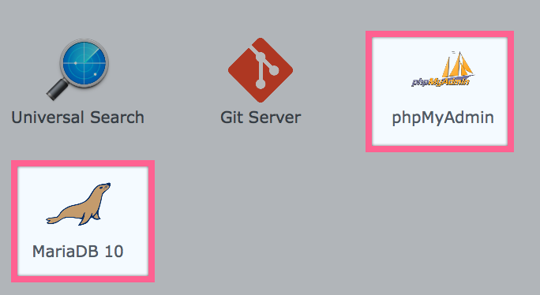
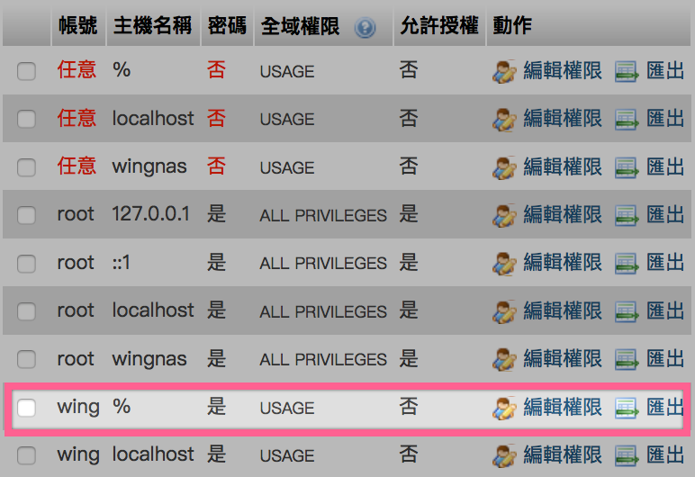
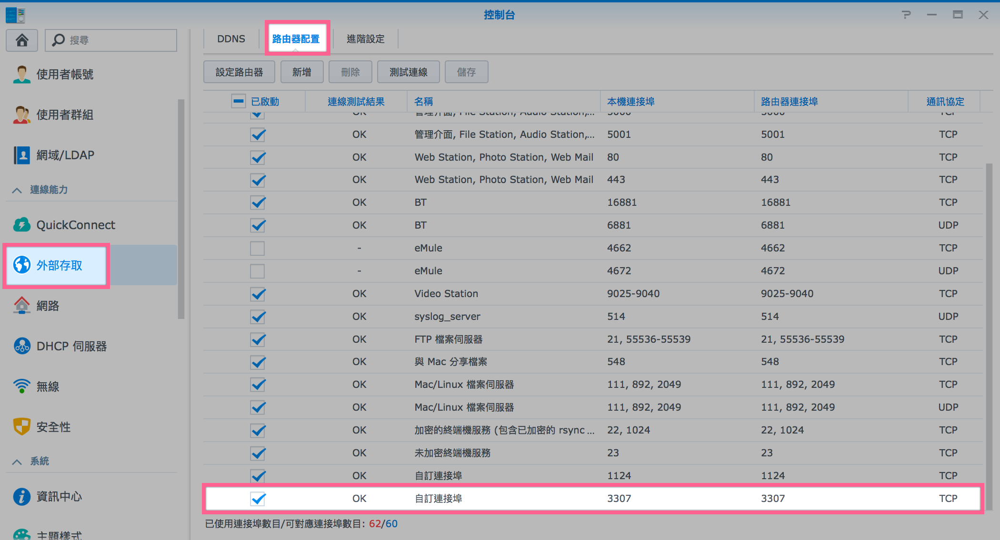
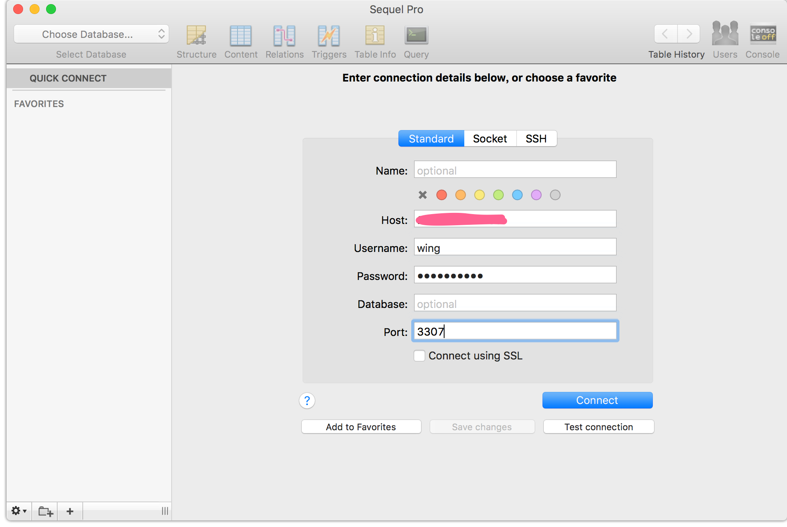
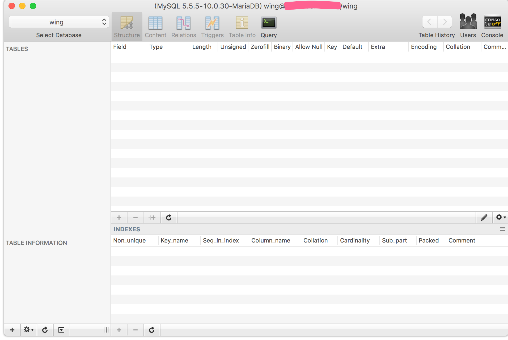
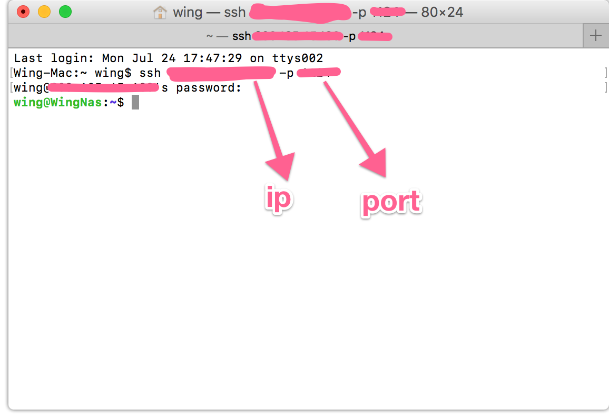
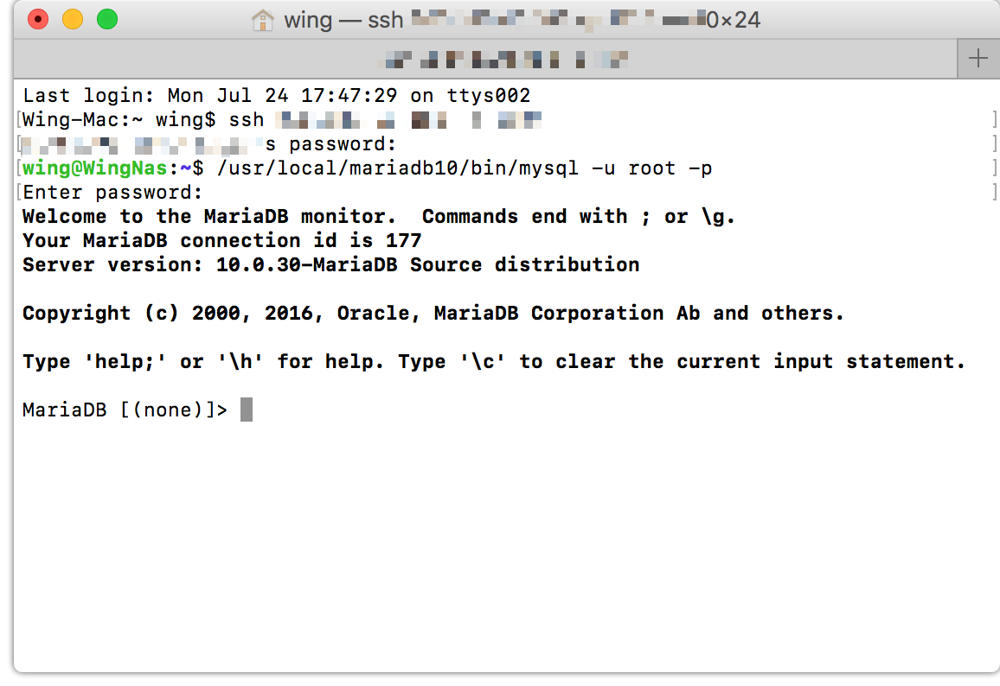

# Synology MariaDB10 Setup
### 用第三方軟件

1. 安裝MariaDB10 and phpMyadmin
    
    
2. 在phpMyadmin set 1個“%”(任意地方連線)個帳號
    

3. 在路由器配置開放3307port(MariaDB10) / 3306port(MariaDB5)
    

4. 現在可以使用第三方軟件 進入你的MariaDB10
    
    成功 !
    

-----

### Terminal
1. 先login你的NAS

 
 
2. 登入Database
> MariaDB 5 :     mysql -u root -p 
> MariaDB 10 :   /usr/local/mariadb10/bin/mysql -u root -p

    

