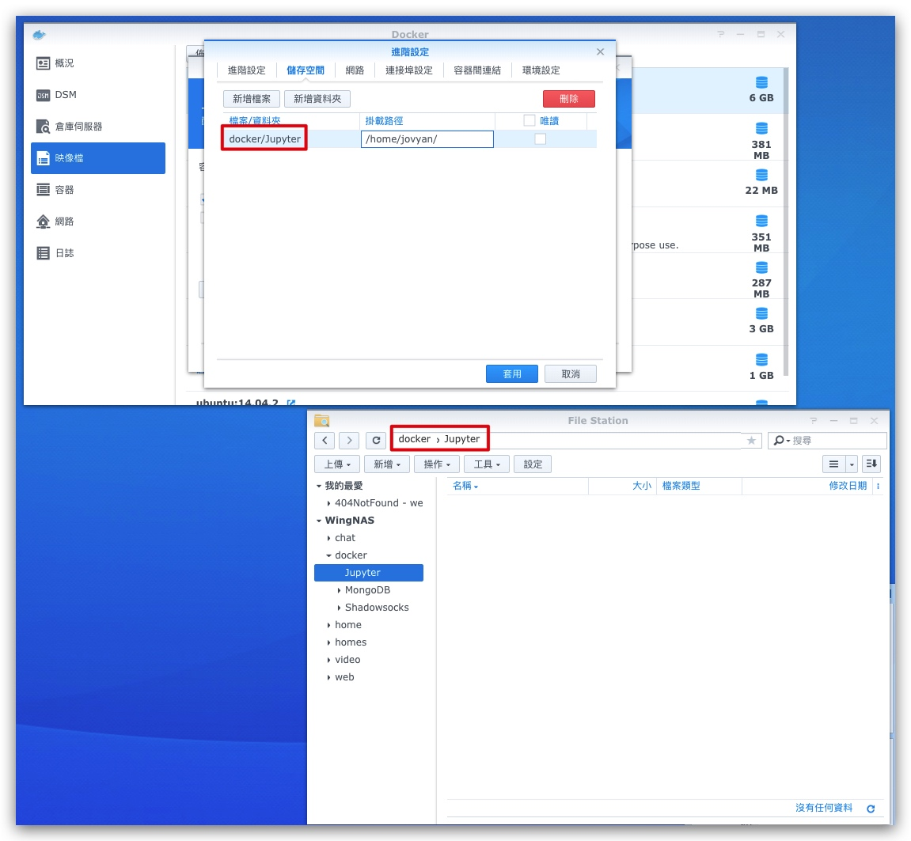

# Synology安裝jupyter-notebook

> Model : DS218+
> System : DSM 6.2

首先，按自己要求選擇Jupyter Docker，可以參考 [Selecting an Image — docker-stacks latest documentation](https://jupyter-docker-stacks.readthedocs.io/en/latest/using/selecting.html)

這次我選擇datascience-notebook

下載完成後，**映像檔** -> `怖置`

點擊`使用更高權限報行容器` (唔肯定是否必須)

設定`儲存空間`方便之後存取文件 -> 套用

完成後在容器會看到剛剛設定的jupyter正在執行, 點擊詳細資料，在本機連接埠會看到現在對外的port是`32796`

點擊終端機 -> 新增 -> 輸入 jupyter notebook list 取得Token

我的Synology local ip位址是`192.168.1.76`

在瀏覽器進入jupyter，格式:`Synology local ip:jupyter對外的port`
現在是 192.168.1.76:32796, 進入後會看到這畫面

輸入Token後會進入此畫面

嘗試新增文件，在之前設定的`儲存空間`內會看見已新增的文件

在這版面可以直接用`pip`安裝其他庫

運行js
https://github.com/pixiedust/pixiedust_node