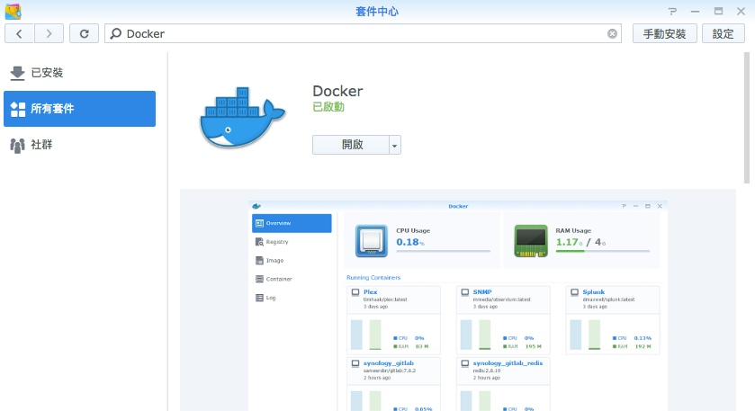
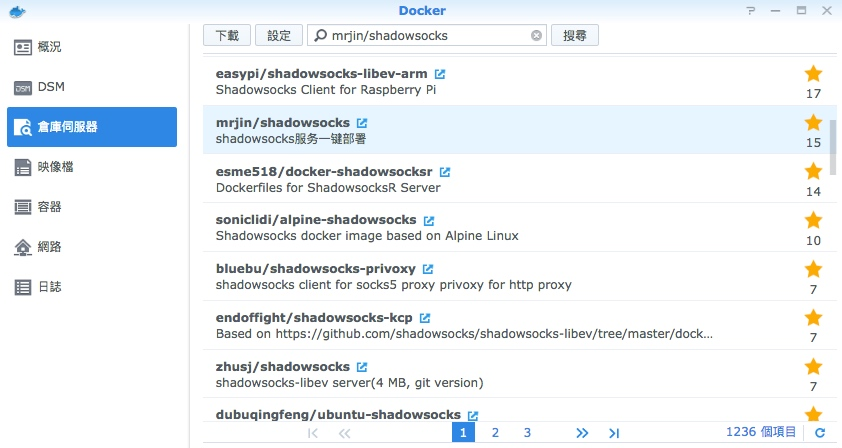
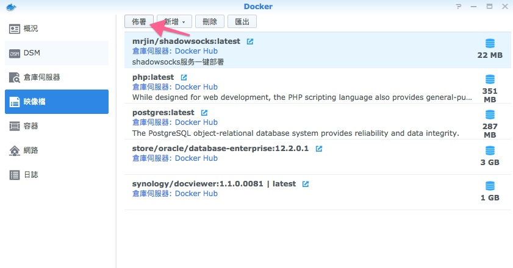
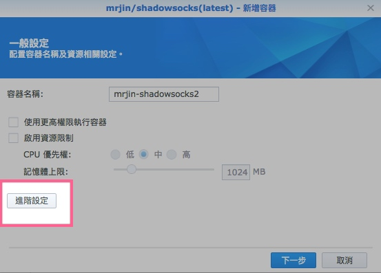
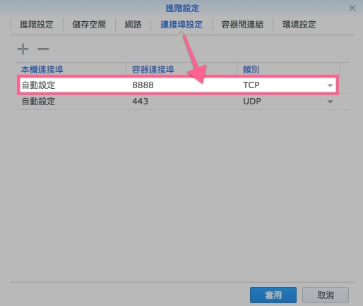
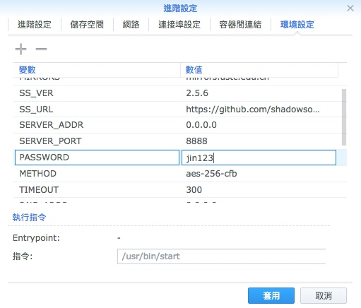
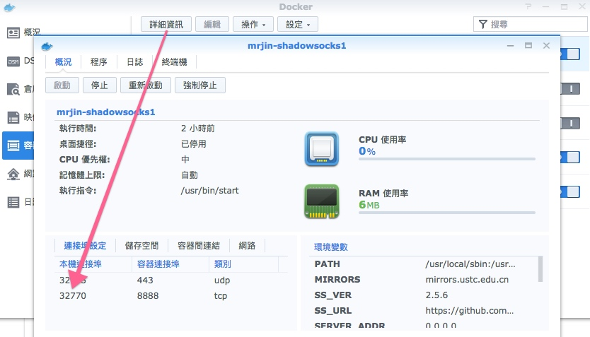
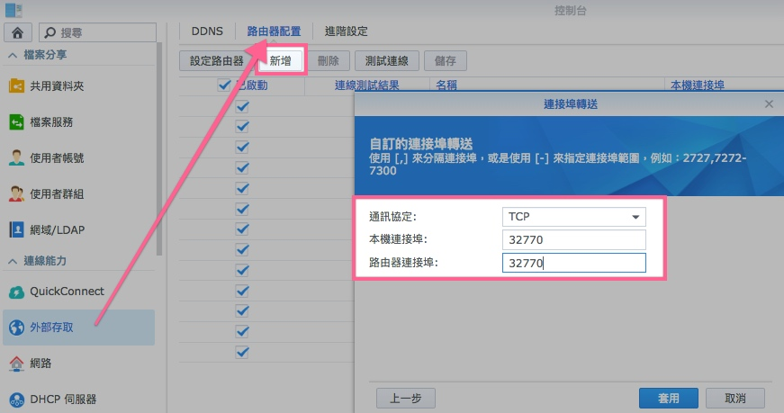

# 在Synology搭建Shadowsocks - Docker

> Model : DS218+
> System : DSM 6.2 

**1. 安裝Docker**

**2. 在Docker安裝 mrjin/shadowsocks**

> 我嘗試過網上不同的方法，只有這個可行和方便（技術有限）

> 本來有一項設定(443 UDP那個)，但不知道有什麼用
> 這裡要自行加一項連接埠(8888 TCP)，因為預設SERVER_PORT是8888
> 同時要在路由器開通，方使外部連接

> 這裡可以修改一些環境變數，例如密碼等，之後按**套用**

**3. 路由器配置**

> 首先查看**本機連接埠**，這裡是32775

> 增加連接埠 -> 套用 -> **儲存**

> 現在ShadowSocks已經設定完成

**4. 手機設備連接ShadowSocks**

iOS免費的話用[Potatso Lite](https://itunes.apple.com/hk/app/potatso-lite/id1239860606?mt=8)

