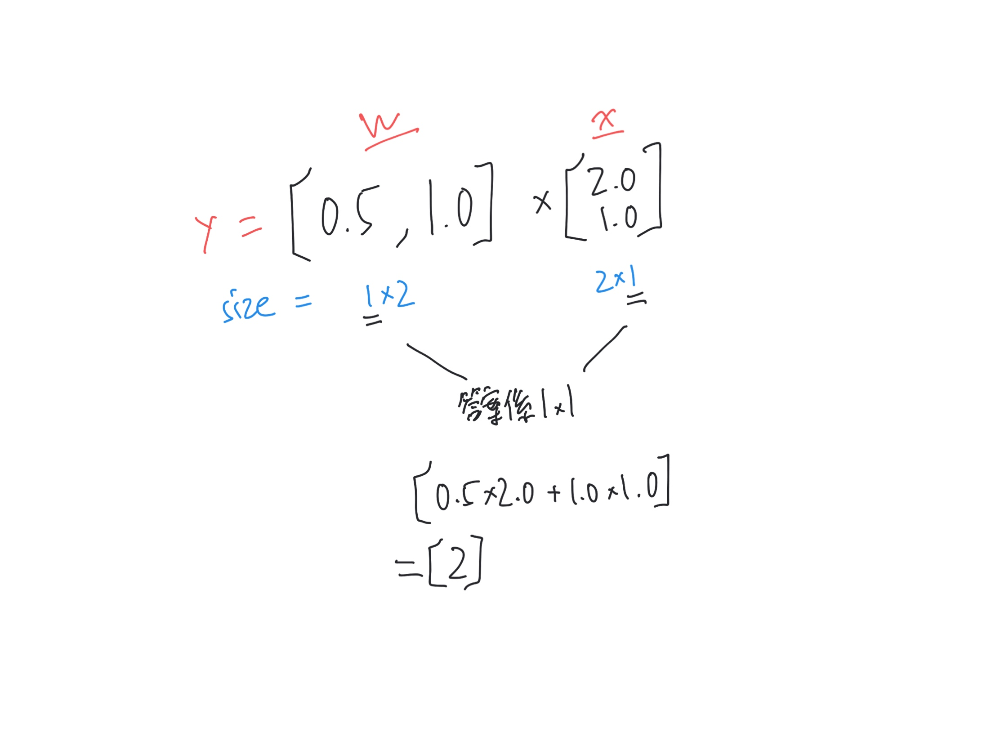

# Tensorflow


```py
# 創建一個變量
w = tf.Variable([[0.5,1.0]])
x = tf.Variable([[2.0],[1.0]]) 

# 矩陣乘法
y = tf.matmul(w, x) # 現在未生效

# 全局變量初始化
init_op = tf.global_variables_initializer()
with tf.Session() as sess:
    sess.run(init_op)
    
    print (y.eval())
```

答案

```
[[2.]]
```




