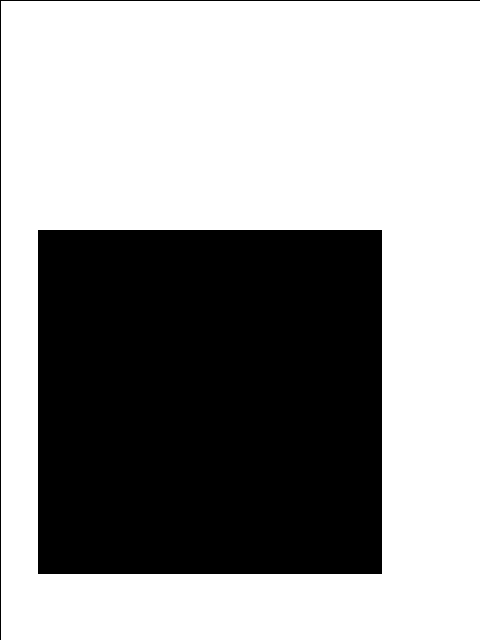
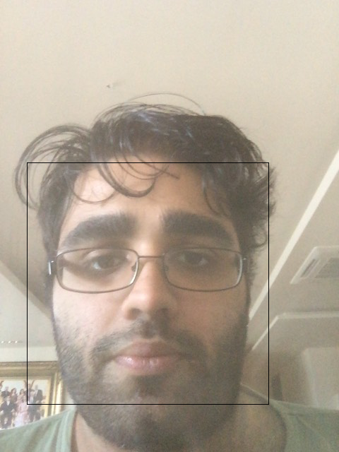
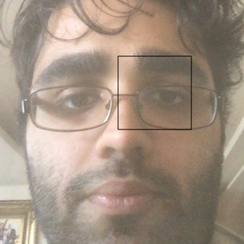
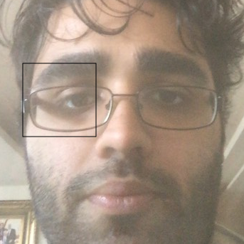
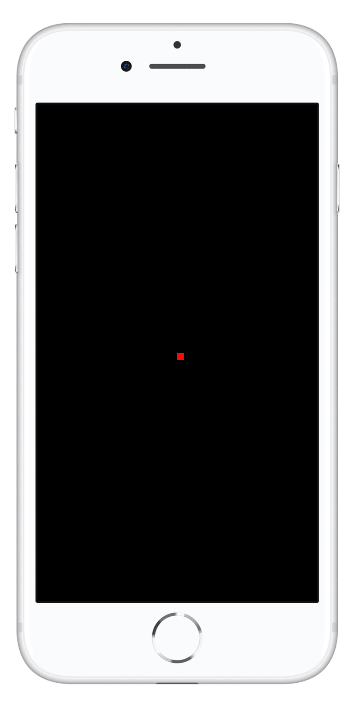

# 目標

將frame(相片)分解成以下部份：用png檔save

1. mask
2. face
3. left_eye
4. right_eye 
5. label.txt(全部的x,y 坐標)

然後save為npz檔


## GazeCapture

| 原圖 | mask | face | left_eye | right_eye |label|
| :-: | :-: | :-: | :-: | :-: | :-: |
|  |  |  |   | |x:160 y:284|


> appleFace.json，appleLeftEye.json，appleRightEye.json

|  |  |
| :-: | :-: |
| H | 邊界框的高度（以像素為單位） |
| W | 邊界框的寬度（以像素為單位） |
| X, Y | 邊界框左上角的位置（以像素為單位） |
| IsValid | 是否真的有檢測.1 =檢測; 0 =沒有檢測。 |

```json
"//": "appleFace.json"
{
  "H": [
    343.669759177,
  ],
  "W": [
    343.678719177,
  ],
  "X": [
    38.1526404115,
  ],
  "Y": [
    230.037120412,
  ],
  "IsValid": [
    1,
  ]
}
```


-------

|  |  |
| :-: | :-: |
| XPts, YPts| 坐標的點 |

```json
{
"//": "dotInfo.json"
  "DotNum": [
    0,
  ],
  "XPts": [
    160,
  ],
  "YPts": [
    284,
  ],
  "XCam": [
    1.064,
  ],
  "YCam": [
    -6.0055,
  ],
  "Time": [
    0.205642,
  ]
}
```


