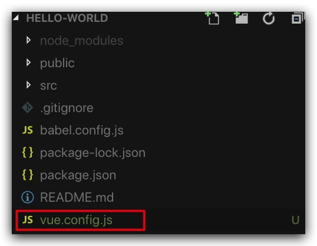
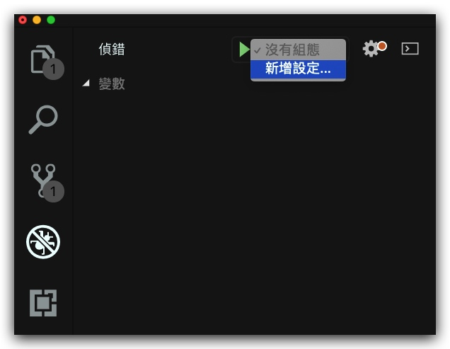
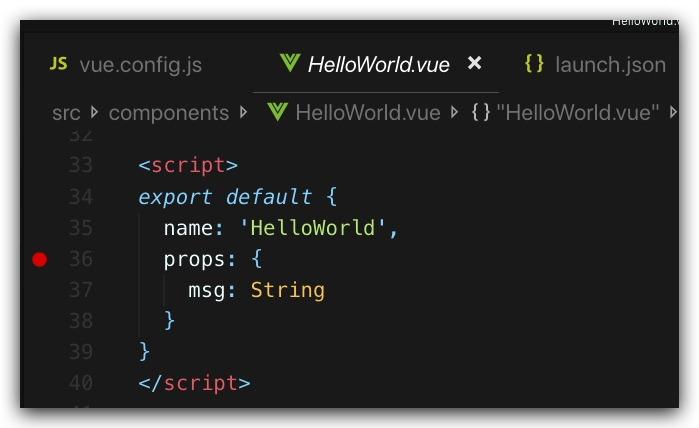
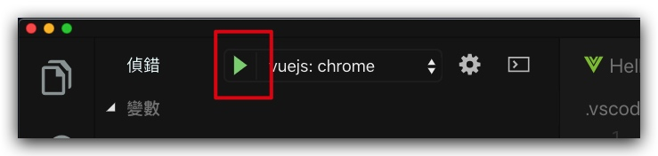
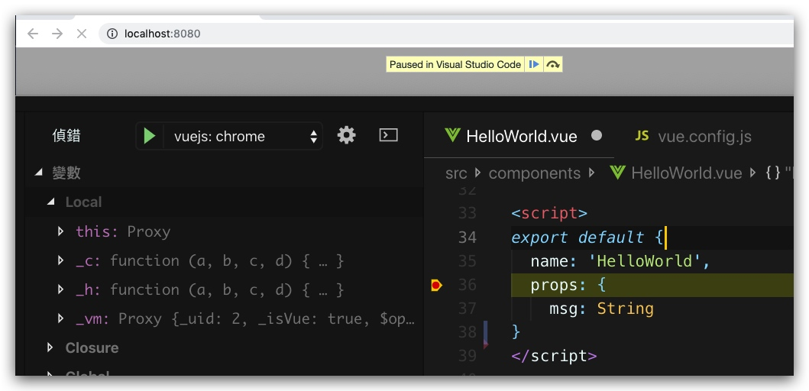

# Vue.js VSCode debug mode

首先建立一個最簡單的Vue.js 項目

```shell
vue create hello-world

cd hello-world
```

在根目錄建立`vue.config.js`, 唔知咩原因預設係無，要手動建立。。。



[更新 webpack 配置以構建 source map](https://cn.vuejs.org/v2/cookbook/debugging-in-vscode.html#%E5%9C%A8%E6%B5%8F%E8%A7%88%E5%99%A8%E4%B8%AD%E5%B1%95%E7%A4%BA%E6%BA%90%E4%BB%A3%E7%A0%81)
```js
module.exports = {
  configureWebpack: {
    devtool: "source-map"
  }
}
```

增設debug設定



**launch.json**：[參考](https://cn.vuejs.org/v2/cookbook/debugging-in-vscode.html#%E4%BB%8E-VS-Code-%E5%90%AF%E5%8A%A8%E5%BA%94%E7%94%A8)
```json
{
  "version": "0.2.0",
  "configurations": [
    {
      "type": "chrome",
      "request": "launch",
      "name": "vuejs: chrome",
      "url": "http://localhost:8080",
      "webRoot": "${workspaceFolder}/src",
      "breakOnLoad": true,
      "sourceMapPathOverrides": {
        "webpack:///./src/*": "${webRoot}/*"
      }
    },
    {
      "type": "firefox",
      "request": "launch",
      "name": "vuejs: firefox",
      "url": "http://localhost:8080",
      "webRoot": "${workspaceFolder}/src",
      "pathMappings": [{ "url": "webpack:///src/", "path": "${webRoot}/" }]
    }
  ]
}
```

設定一個break point


運行
```shell
npm run serve

App running at:
  - Local:   http://localhost:8080/ <- 要對應番launch.json 個port
  - Network: http://192.168.1.137:8080/
```

開始debug mode


成功!!!

