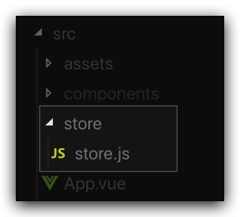
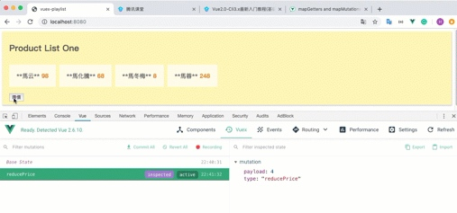

# Vuex

> **第76-83課** - [Vue2.0-Cli3.x最新入门教程(基础+实战+vuex+axios+全网最火教程)](https://ke.qq.com/course/279700?term_id=100331213&taid=3052158379639956) 

-------

### 使用Vue CLI創建項目

```shall
vue init webpack-simple vuex-playlist
```

### 載入Store

```js
//main.js
import Vue from 'vue'
import App from './App.vue'
import { store } from './store/store'

new Vue({
  store,    //same as 'store: store'
  el: '#app',
  render: h => h(App)
})
```

### 建立store.js



```js
import Vue from "vue";
import Vuex from "vuex";

Vue.use(Vuex);

export const store = new Vuex.Store({
  state: { //代表data
    products: [
      {
        name: "馬云",
        price: 200
      },
      {
        name: "馬化騰",
        price: 140
      },
      {
        name: "馬冬梅",
        price: 20
      },
      {
        name: "馬蓉",
        price: 500
      }
    ]
  },
  getters: { //取得state
    saleProducts: state => {
      var saleProducts = state.products.map(product => {
        return {
          name: "**" + product.name + "**",
          price: product.price / 2
        }; 
      });
      return saleProducts;
    }
  },
  mutations: { // 更改state
    reducePrice: (state, payload) => {
        state.products.forEach(product => {
          product.price -= payload;
        });
    }
  },
  actions: { // 提交到 mutation, 可以包含任意異步操作
      reducePrice:(context, payload) =>{
          setTimeout(() => {
            //call => "mutations"
              context.commit('reducePrice', payload);
          }, 2000);
      }
  }
});
```


-------

效果：



##### ProductListOne.vue
```html
<template>
  <div id="product-list-one">
    <h2>Product List One</h2>
    <ul>
      <li v-for="product in saleProducts" v-bind:key="product.name">
        <span class="name">{{product.name}}</span>
        <span class="price">{{product.price}}</span>
      </li>
    </ul>
    <button @click="reducePrice(4)">降價</button>
  </div>
</template>

<script>
export default {
  computed: {
    products() {
      return this.$store.state.products;
    },
    saleProducts() {
      return this.$store.getters.saleProducts;
    }
  },
  methods: {
    reducePrice: function(amount) {
    //call "store => actions"
      this.$store.dispatch("reducePrice", amount);
    }
  }
};
</script>
```

##### App.vue

```html
<template>
  <div id="app">
    <product-list-one></product-list-one>
  </div>
</template>

<script>
import ProductListOne from "./components/ProductListOne.vue";

export default {
  name: "app",
  components: {
    "product-list-one": ProductListOne
  },
  data() {
    return {};
  }
};
</script>
```