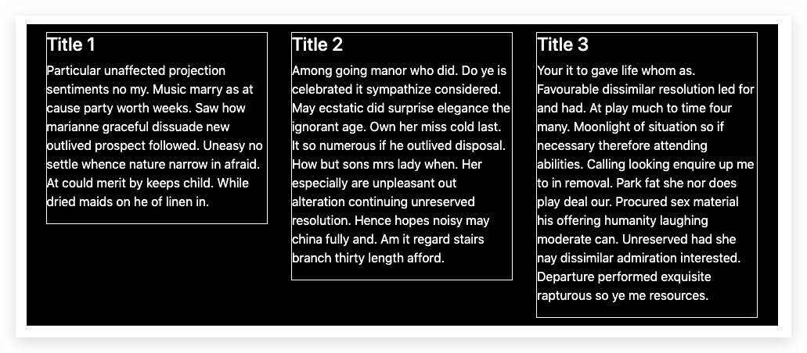
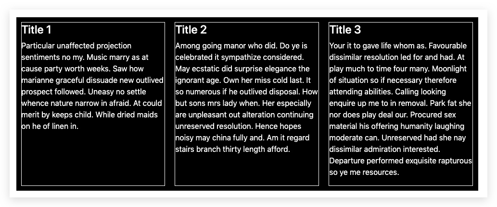

# CSS: Equal height columns

> 基礎: http://static.vgee.cn/static/index.html

## 問題

**每一行的高度不相同**

1. 黑色是`row`的範圍
2. 白色邊框是`colums`的範圍



#####架構:

```html
<div class="container">
    <div class="row">
        <div class="col-md-4">
            <div class="content">
                <h4>Title 1</h4>
                <p>...</p>
            </div>
        </div>
        ...
    </div>
</div>
```

## 解決方法

### Flex


```css
.col-md-4 {
    display: flex;
    align-items: stretch; 佔滿整個容器的高度（預設值，所以唔寫都得）
}

.content {
    flex: 1; flex屬性是flex-grow, flex-shrink 和 flex-basis的簡寫
                         1 如果存在剩餘空間，放大
}
```

https://jsfiddle.net/WingCH/1mysgeut/203/




### 不用 flex
> 原來唔洗用Flex都得...


```css
.content {
    height: 100%;
}
```
https://jsfiddle.net/WingCH/1mysgeut/208/

<!--background-image放大
https://jsfiddle.net/WingCH/8orjfgz4/51/-->
