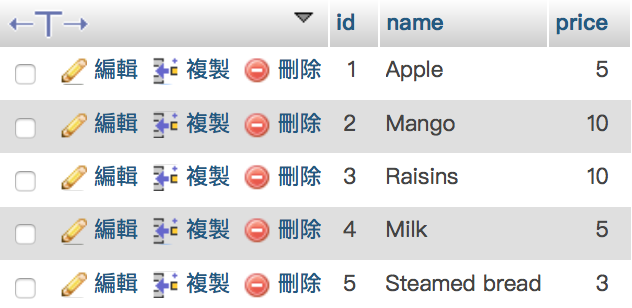

# IOS 原生 vs Alamofire+SwiftyJSON

##### Database data
* id : Int
* name : String
* price: Int




##### Food.swift

```swift
class Food: NSObject {
    
    var id: Int
    var name: String
    var price: Int
    
    init(id: Int, name: String, price: Int) {
        self.id = id
        self.name = name
        self.price = price
    }
    
}
```

-------

## 不用任何第三方庫做法


```swift
class ViewController: UIViewController {
    
    
    override func viewDidLoad() {
        super.viewDidLoad()
        
        var foodList : [Food] = []
        
        //https://code.bradymower.com/swift-3-apis-network-requests-json-getting-the-data-4aaae8a5efc0
        //Example 5
        let config = URLSessionConfiguration.default
        let session = URLSession(configuration: config)
        let url = URL(string: "http://www.wingnashk.synology.me/php/getFoodData.php")!
        //拎資料
        let task = session.dataTask(with: url) { (data, response, error) in
            //如果statusCode != 200 代表有問題 -> 不執行下面的code
            guard ((response as! HTTPURLResponse).statusCode == 200) else {
                return
            }
            
            if error != nil {
                print("error: ", error!.localizedDescription)
            } else {
                if let data = data{
                    //Data -> json -> array
                    let json_array : [[String : AnyObject]] =
                        try! JSONSerialization.jsonObject(with: data,
                                                          options: .allowFragments) as! [[String : AnyObject]]
                    //[json] -> [Food]
                    for foodInfo in json_array {
                        let food : Food = Food(id: foodInfo["id"]! as! Int,
                                               name: foodInfo["name"]! as! String,
                                               price: foodInfo["price"]! as! Int)
                        foodList.append(food)
                    }
                    
                    for food in foodList {
                        print("id: \(food.id)")
                        print("name: \(food.name)")
                        print("price: $\(food.id)")
                        print("---------")
                    }
                }
            }
        }
        //async
        task.resume()
    }
    
    override func didReceiveMemoryWarning() {
        super.didReceiveMemoryWarning()
        
    }
    
    
}
```
> 可以看到一些不太明白的code 例如` URLSessionConfiguration.default` `URLSession(configuration: config)`
> 很多強制轉換的情況 例如 `as! [[String : AnyObject]]` `as! String`
> **可讀性差**


## Alamofire+SwiftyJSON做法


```swift
class ViewController: UIViewController {
    
    override func viewDidLoad() {
        super.viewDidLoad()
        
        var foodList : [Food] = []
        
        Alamofire.request("http://www.wingnashk.synology.me/php/getFoodData.php").responseJSON { response in
            //如果 result fail (!= 200)代表有問題 (可自定義)-> 不執行下面的code
            guard (response.result.isSuccess) else {
                return
            }
            if let data = response.result.value {
                //data -> json
                let json = JSON(data)
                //json -> array
                for (_,subJson):(String, JSON) in json {
                    let food : Food = Food(id: subJson["id"].int!,
                                           name: subJson["name"].string!,
                                           price: subJson["price"].int!)
                    foodList.append(food)
                }
                
                for food in foodList {
                    print("id: \(food.id)")
                    print("name: \(food.name)")
                    print("price: $\(food.id)")
                    print("---------")
                }
                
            }
            
        }
    }
    
    override func didReceiveMemoryWarning() {
        super.didReceiveMemoryWarning()

    }
    
    
}
```
> 相比原生的做法 
> Alamofire大大簡化了網絡請求的操作 例如不用理會` URLSessionConfiguration` `URLSession` 
> SwiftyJSON配合Alamofire使用，令解析json變得更簡單
> **可讀性高**


