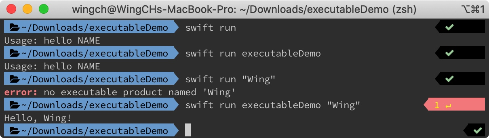

# Swift Package Manager

> https://www.jianshu.com/p/89a7bd338a78

## 功能1: 創建可執行程序


```shell
mkdir executableDemo     
cd executableDemo

swift package init --help
swift package init --type executable
```


```swift
// main.swift
if CommandLine.arguments.count != 2 {
    print("Usage: hello NAME")
} else {
    let name = CommandLine.arguments[1]
    sayHello(name: name)
}
```

```swift
// Greeter.swift (Created by yourself)
func sayHello(name: String) {
    print("Hello, \(name)!")
}
```



## 功能2: 類似 CocoaPods 作為第三方包管理器.

> SwiftJSON : https://github.com/SwiftyJSON/SwiftyJSON#swift-package-manager

```swift
// Package.swift
let package = Package(
    name: "executableDemo",
    dependencies: [
        // Dependencies declare other packages that this package depends on.
        // .package(url: /* package url */, from: "1.0.0"),
        .package(url: "https://github.com/SwiftyJSON/SwiftyJSON.git", from: "4.0.0"),
    ],
    targets: [
        // Targets are the basic building blocks of a package. A target can define a module or a test suite.
        // Targets can depend on other targets in this package, and on products in packages which this package depends on.
        .target(
            name: "executableDemo",
            dependencies: ["SwiftyJSON"]),
        .testTarget(
            name: "executableDemoTests",
            dependencies: ["executableDemo"]),
    ]
)
```


```shell
swift build
```


Test in `/executableDemo/Sources/executableDemo/main.swift`


```swift
//main.swift
let json = JSON(["name": "Jack", "age": 25])
print(json)
```


```shell
swift run
```
**成功利用`SwiftyJSON`庫**


-----

### 也可以在Xcode 11 使用

> 貌似要手動更新，如果使用了上述的方法
```shell
swift package generate-xcodeproj
```


> Alamofire: https://github.com/Alamofire/Alamofire#swift-package-manager


