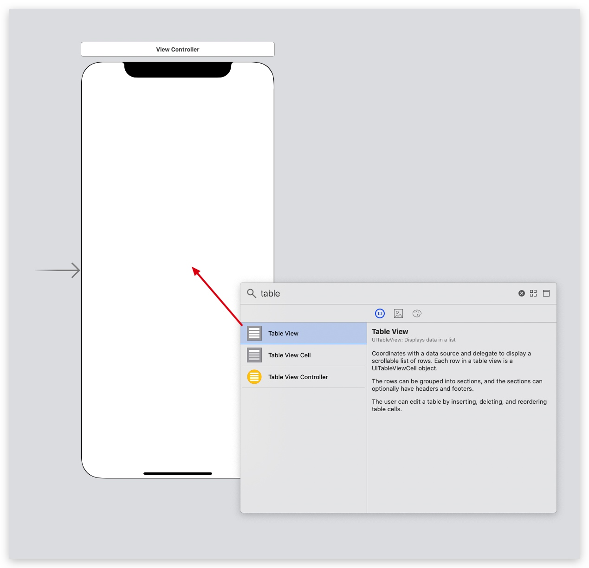
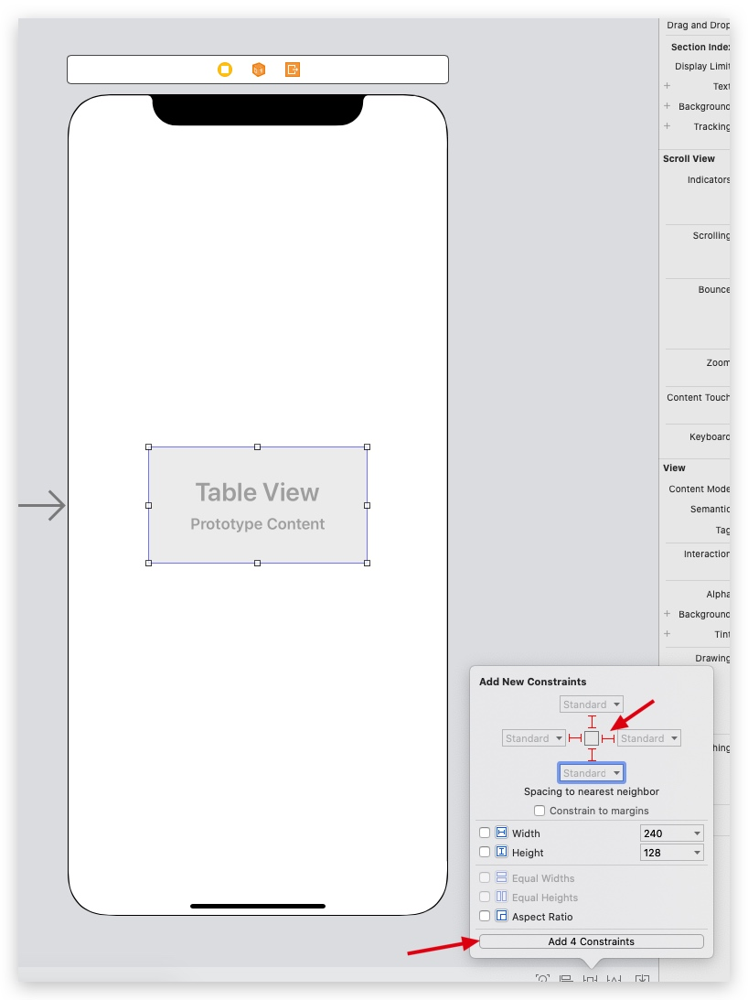
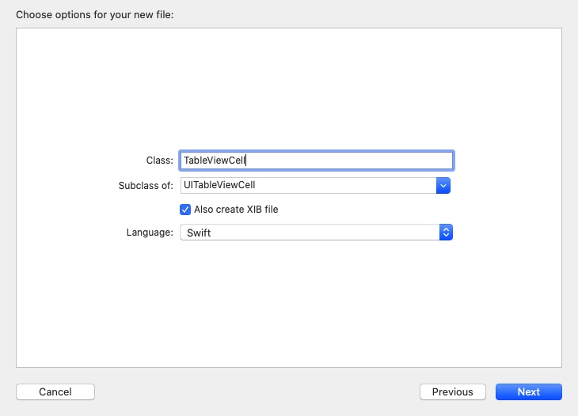
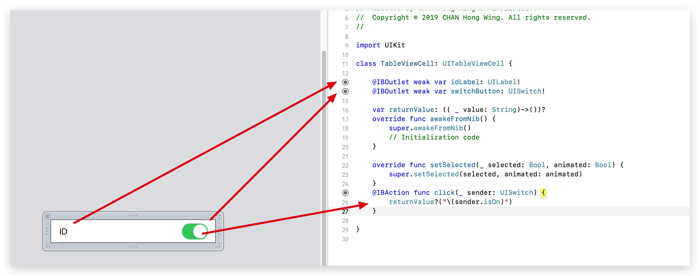

# Table View Custom Cell and Callback

## Init TableView in storyboard

首先拉`TableView`入View Controller


設定Autolayout，Table View 佔滿整個View


## Model

 > 假設場景是家裡不同的房間開關燈
 
```swift
//Room.swift
class Room {
    var id: Int
    var name: String
    var lightOpen: Bool

    internal init(id: Int, name: String, lightOpen: Bool) {
        self.id = id
        self.name = name
        self.lightOpen = lightOpen
    }
}
```

## Cell





```swift
import UIKit

class TableViewCell: UITableViewCell {

    @IBOutlet weak var idLabel: UILabel!
    @IBOutlet weak var switchButton: UISwitch!
    
    //callback function
    var returnValue: (( _ value: String)->())?
    override func awakeFromNib() {
        super.awakeFromNib()
    }

    override func setSelected(_ selected: Bool, animated: Bool) {
        super.setSelected(selected, animated: animated)
    }
    
    //click switch button時callback
    @IBAction func click(_ sender: UISwitch) {
        returnValue?("\(sender.isOn)")
    }
    
}
```

## tableview


```swift
import UIKit

class ViewController: UIViewController, UITableViewDataSource, UITableViewDelegate {
    var restaurantNames: [Room] = []
    
    @IBOutlet var tableView: UITableView!
    
    override func viewDidLoad() {
        super.viewDidLoad()
        
        restaurantNames.append(Room(id: 1, name: "客廳", lightOpen: true))
        restaurantNames.append(Room(id: 1, name: "廚房", lightOpen: false))
        restaurantNames.append(Room(id: 1, name: "洗手間", lightOpen: true))
        
        tableView.delegate = self
        tableView.dataSource = self
        
        tableView.register(UINib(nibName: "TableViewCell", bundle: nil), forCellReuseIdentifier: "customCell")
    }
    
    func tableView(_ tableView: UITableView, numberOfRowsInSection section: Int) -> Int {
        return restaurantNames.count
    }
    
    func tableView(_ tableView: UITableView, cellForRowAt indexPath: IndexPath) -> UITableViewCell {
        let cell = tableView.dequeueReusableCell(withIdentifier: "customCell") as! TableViewCell
        
        cell.idLabel?.text = restaurantNames[indexPath.row].name
        cell.switchButton?.isOn = restaurantNames[indexPath.row].lightOpen
        
        //當cell switch click callback會到呢度
        cell.returnValue = { value in
            print(self.restaurantNames[indexPath.row].name)
            print(value)
        }
        return cell
    
```


code:
https://drive.google.com/file/d/1Abq7_05wN84I28btYcx5Hk28ckThn1cp/view?usp=sharing