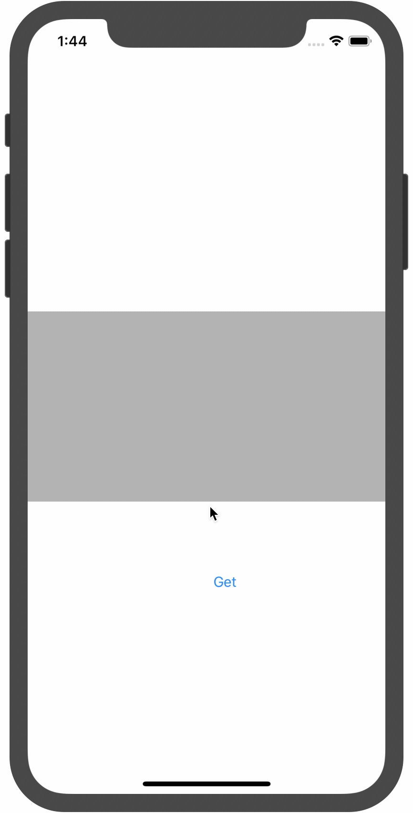

# iOS PromisesKit

> 參考:
> 
> [深入解析 Promises　輕鬆控制 Parallel Programming (平行程式設計)]([https://www.appcoda.com.tw/promises/])
>
>[Swift - 异步编程库PromiseKit使用详解1（安装配置、基本用法）](https://www.hangge.com/blog/cache/detail_2231.html)

[source code](https://github.com/WingCH/try-promises-kit)




---

## Use cloudflare worker as API

```js
addEventListener('fetch', event => {
  event.respondWith(handleRequest(event.request))
})

/**
 * Respond to the request
 * @param {Request} request
 */
async function handleRequest(request) {
  return new Response('https://via.placeholder.com/150', {status: 200})
}
```

> just return url 


---
## iOS

### Step
1. 	call `cloudflare worker` ([https://muddy-band-6107.wingch.workers.dev/](https://muddy-band-6107.wingch.workers.dev/)) to geting `image url`
2. use `image url` get image
3. show image

#### Use Callback function

> source: https://www.appcoda.com.tw/promises/

```swift
let backendUrl = URL(string: "https://muddy-band-6107.wingch.workers.dev/")

//call api to geting image url
URLSession.shared.dataTask(with: backendUrl!) { data, _, error in
    if error != nil {
        print(error!)
        return
    }
    let imageurl = String(data: data!, encoding: String.Encoding.utf8) as String? // For simplicity response is only the URL
    
    //use image url get image 
    URLSession.shared.dataTask(with: URL(string:imageurl!)!) { (data, response, error) in
        if error != nil {
            print(error!)
            return
        }
        
        //show image
        DispatchQueue.main.async {
            self.imageView.image = UIImage(data: data!)
        }
    }.resume()
    
}.resume()
```

#### Use PromiseKit

> [https://github.com/mxcl/PromiseKit](https://github.com/mxcl/PromiseKit)

> define Error

```swift
enum CustomError:Error {
    case convertUrlProblem
}

extension CustomError: LocalizedError {
    public var errorDescription: String? {
        switch self {
        case .convertUrlProblem:
            return NSLocalizedString("Cannot convert data to Url", comment: "")
        }
    }
}
```

> define Promise

```swift
func fetchPromise(url: URL) -> Promise<Data> {
    return Promise { resolver in
        URLSession.shared.dataTask(with: url) { data, _, error in
            // error ? reject : fulfill
            resolver.resolve(data, error)
        }.resume()
    }
}
    
func getUrlPromise(data: Data) -> Promise<URL> {
    return Promise<URL> { resolver in
        
        // For simplicity response is only the URL
        let imageurl = String(data: data, encoding: String.Encoding.utf8) as String?
        
        if let request = URL(string:imageurl!){
            resolver.fulfill(request)
        }else{
            resolver.reject(CustomError.convertUrlProblem)
        }
    }
}
    

```

> implement


```swift
fetchPromise(url: backendUrl!).then{ data in
    return getUrlPromise(data: data)
}.then{ data in
    return fetchPromise(url: data)
}.done { data in
    self.imageView.image = UIImage(data: data)
}.catch{
    error in
    print(error.localizedDescription)
}
```

> Clearly code style with the same result

```swift
fetchPromise(url: backendUrl!)
    .then(getUrlPromise)
    .then(fetchPromise)
    .done{ data in
        self.imageView.image = UIImage(data: data)
}.catch{
    error in
    print(error.localizedDescription)
}
```