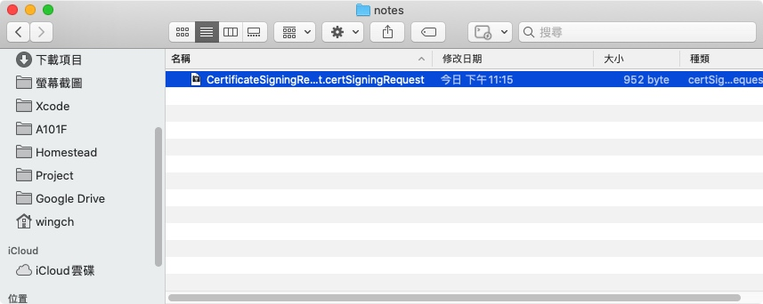
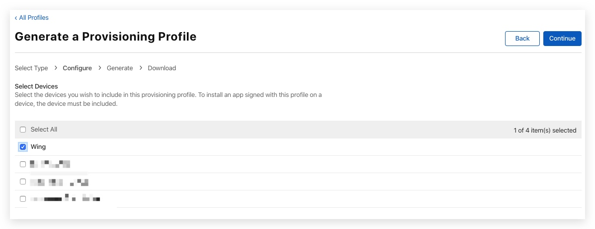

# iOS Signing

1. Automatically manage signing


1. 手動

-------
首先, 記錄一下在 https://developer.apple.com/ 以下項目剛開始的模樣

* Certificates
* Identifiers
* Devices
* Profiles

# Automatically manage signing

創建一個新的Project, 記錄一下**Bundle Identifier**

點擊 `Automatically manage signing`

選擇 Apple developer 帳號

在 https://developer.apple.com/ 上可以見到Xcode幫我生成了兩個文件
分別是 1張`Certificates (Development)`和1張`Identifiers (Provisioning Profile)`

> Certificates還沒有Distribution, 下面再説

Xcode 會自動生成 **Debug** 和 **Release** 的 `Provisioning Profile`

> 可以在`/Users/wingch/Library/MobileDevice/Provisioning Profiles`找到

Xcode會自動生成一張Bundle Identifier為`*`的Provisioning, 並將我Apple id已注册的Devices一併加入

## Distribution

Certificates 一共有兩張 `Development` 和 `Distribution`
上述Xcode只生成了Certificates (Development)，當我們要發佈Apps時就需要`Distribution`

這次選`Ad Hoc`做例子 

> over-the-air 日後再研究...

因為我們沒有Certificates(Distribution), 所以按`Automatically manage signing` 看看有什麼效果

成功生成！

可以在https://developer.apple.com/ 看到多了一張Distribution

> /Users/wingch/Library/MobileDevice/Provisioning Profiles/17fa3c2a-82c8-400b-ba2e-d09f42d93398.mobileprovision

Export ipa 檔案

> 下一步可以[自行製作plist](https://wenrongdev.com/install-ipa-with-ota/)或 上傳到[蒲公英](https://www.pgyer.com/) 等方法下載apps到手機 (只有provision內有的devices才可以安裝)

-------

# 手動

> 參考: [iOS之从创建（Development、Distribution）证书到发布](https://www.jianshu.com/p/304ec98842e1)

創建一個新的Project, 記錄一下**Bundle Identifier**
> Bundle Identifier: try.winch.try-winch-iOS-Signing2

1. Identifiers: 註冊Bundle Identifier
2. 申請Certificates `Development` `Distribution` （用於允許在Mac上簽名）
3. 申请Development描述文件

##  1. Identifiers: 註冊Bundle Identifier

Description 隨便填, Bundle ID填剛剛開的Project `try.winch.try-winch-iOS-Signing2`

可以看到新增了一項

## 2. 申請Certificates `Development` `Distribution` （用於允許在Mac上簽名）

生成以下檔案`CertificateSigningRequest.certSigningRequest`

使用剛剛生成的`CertificateSigningRequest.certSigningRequest`

成功生成`development.cer`, 現在還差`Distribution`, 再做多次上三張圖的步驟

最終效果, 雙點擊 `development.cer` 和 `distribution.cer`加入**鑰匙圈**

> 可以輸出p12, 我理論類似是加密了的zip 用於分享給其他人
> 

## 3. 申请Development描述文件

選擇Project的Bundle Id

選擇Development證書

選擇可以測試的設備

到Distribution, 今次嘗試Ad Hoc

最終效果

接下來是在Xcode使用
Debug使用`learning__development.mobileprovision`

Release使用`learning_distribution.mobileprovision`

> 發怖方面與`Automatically manage signing`一樣

-------

